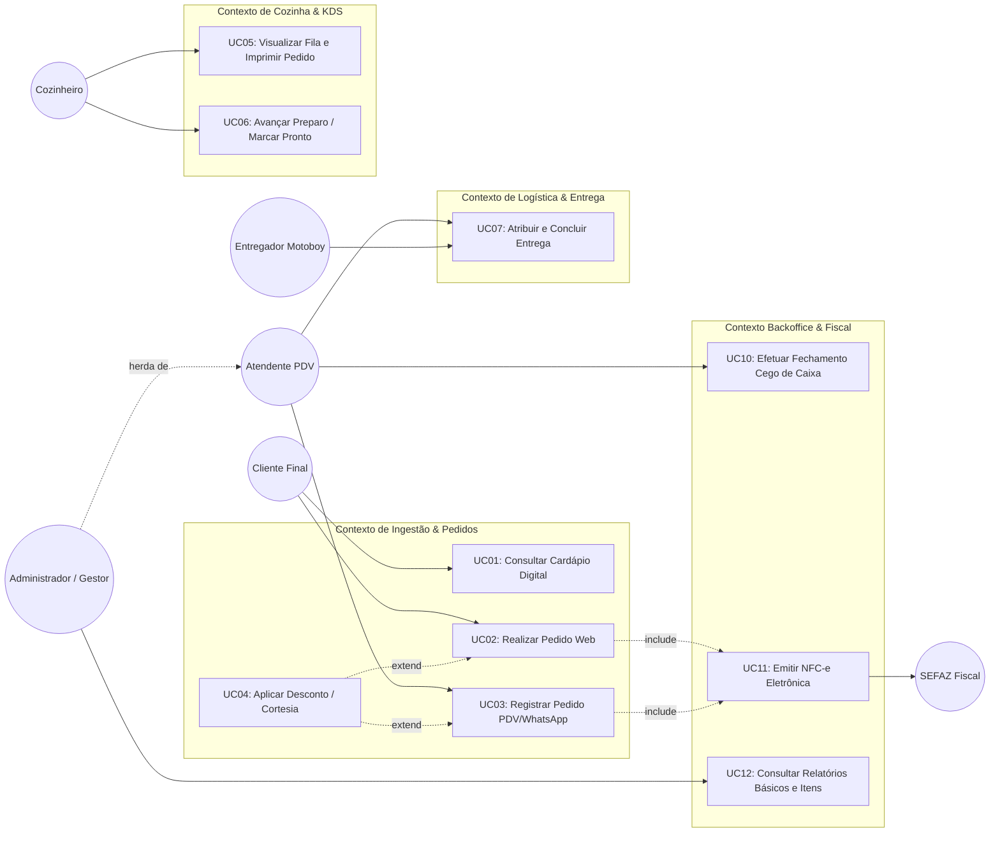
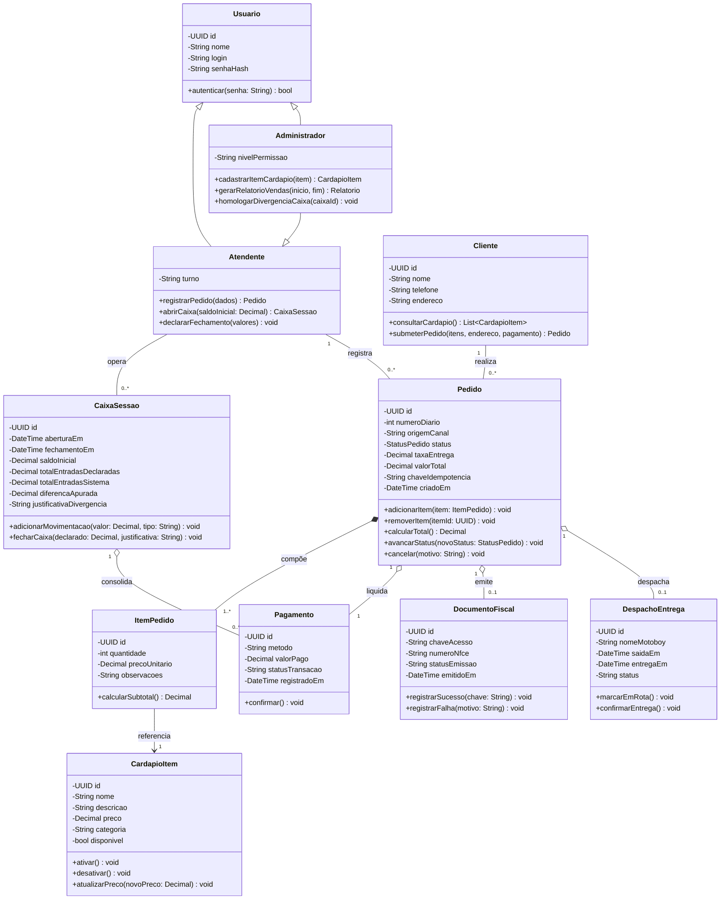
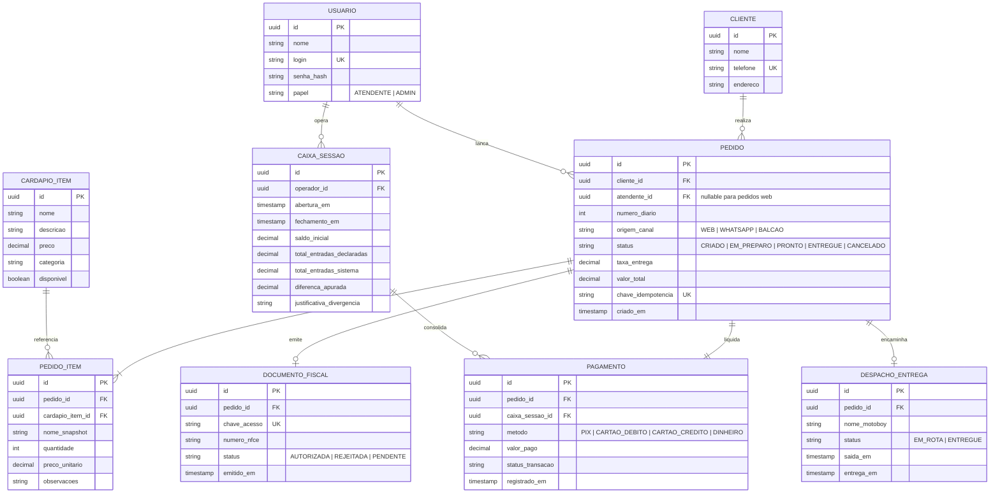
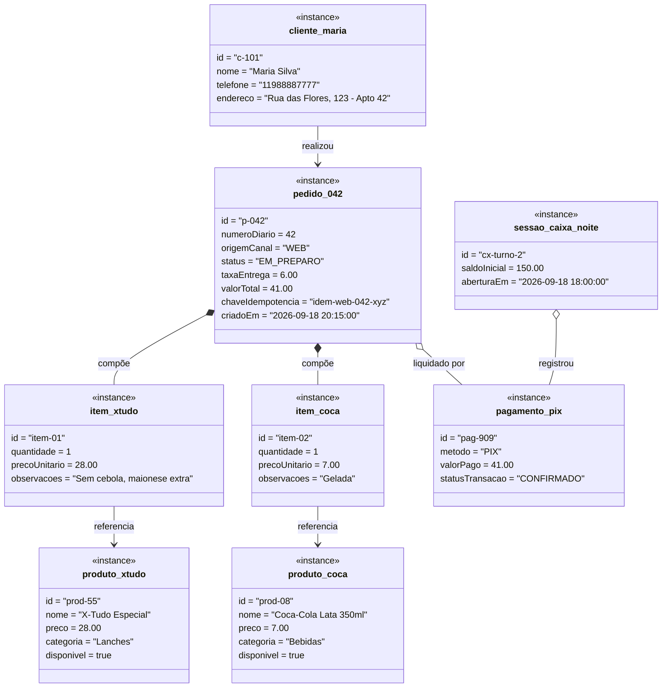
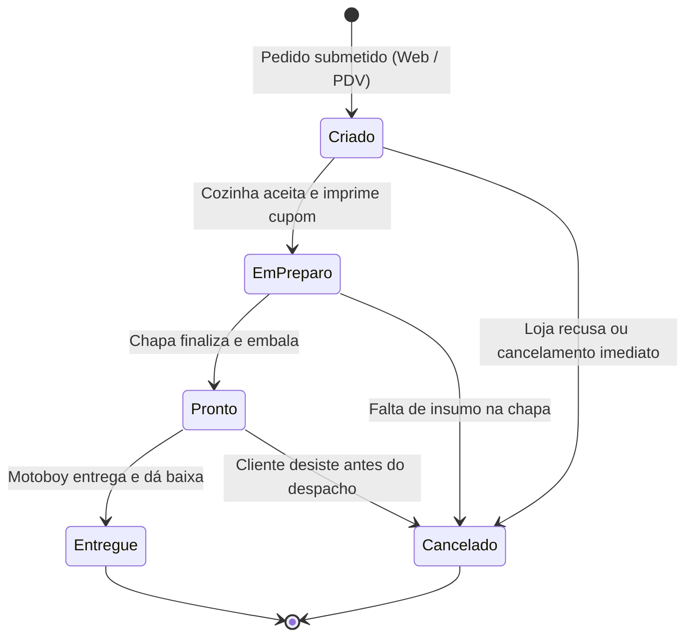
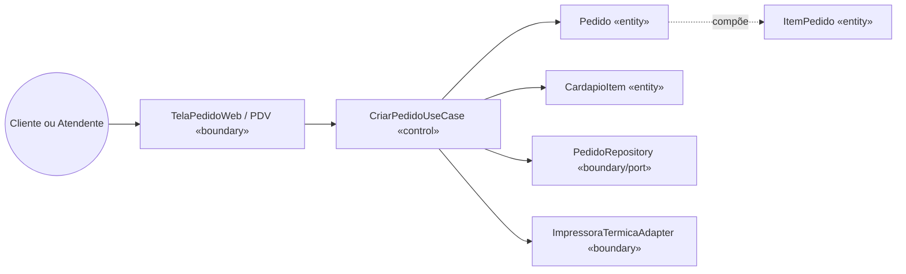
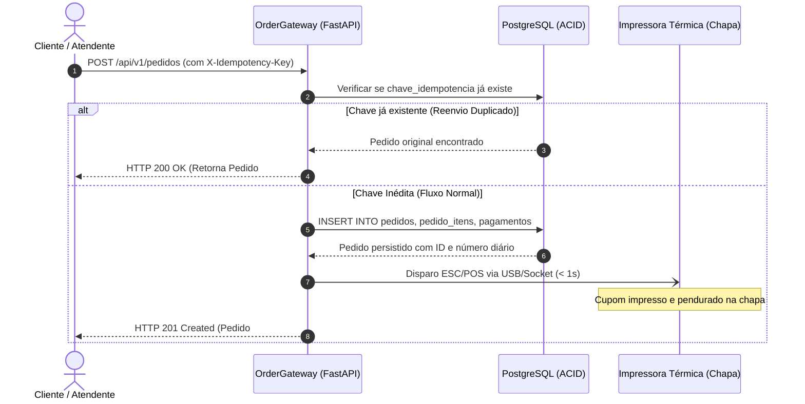
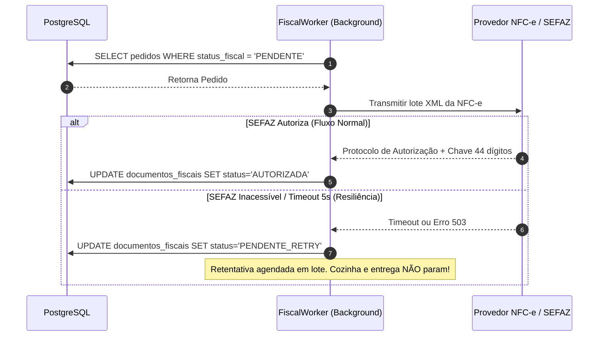
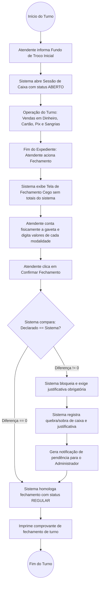
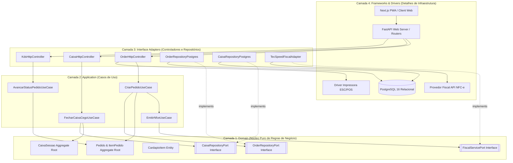

# Especificação Completa e Documento de Ideação: Plataforma Unificada de Gestão de Delivery

> **Documento Final de ideação**  
> *Versão:* 2.1 
> *Status:* Aprovado para Execução  
> *Data de Atualização:* 18/09/2026  
> *Escopo:* Ideação, Arquitetura de Software, Modelagem DDD, Requisitos, Resolução de Lacunas Críticas, Diagramas Técnicos e Roadmap de Implementação.

---

## 📋 Sumário Executivo

1. [Visão Geral & Proposta de Valor](#1-visão-geral--proposta-de-valor)
2. [Modelagem de Domínio (DDD) & Linguagem Ubíqua](#2-modelagem-de-domínio-ddd--linguagem-ubíqua)
3. [Engenharia de Requisitos (RF e RNF)](#3-engenharia-de-requisitos-rf-e-rnf)
4. [Arquitetura de Software & Paradigma de Implementação](#4-arquitetura-de-software--paradigma-de-implementação)
5. [Decisões Críticas de Engenharia](#5-decisões-críticas-de-engenharia)
6. [Lacunas Críticas e Resoluções](#6-lacunas-críticas-e-resoluções)
7. [Inovação e Inteligência Artificial (Fase Futura)](#7-inovação-e-inteligência-artificial-fase-futura)
8. [Modelagem Visual do Sistema (Diagramas Técnicos Mermaid)](#8-modelagem-visual-do-sistema-diagramas-técnicos-mermaid)
9. [Estratégia de Implementação e Qualidade](#9-estratégia-de-implementação-e-qualidade)
10. [Roadmap de Execução, Fases e Matriz de Riscos](#10-roadmap-de-execução-fases-e-matriz-de-riscos)

---

## 1. Visão Geral & Proposta de Valor

### 1.1 O Problema Operacional Real
A lanchonete delivery familiar enfrenta os seguintes desafios operacionais:
- **Plataforma terceira inadequada**: relatórios superficiais, cardápio engessado, complementos complexos, difícil alterar/registrar itens
- **WhatsApp ambíguo**: pedidos informais ("2 x-tudo, 1 x-tudo sem tomate" em 2 mensagens = 3 lanches?), clientes trocam endereço na hora
- **Fluxo manual ineficiente**: cliente manda WhatsApp → atendente lança na plataforma terceira → imprime → pendura na chapa → chapeiro pega
- **Pagamento fragmentado**: 2 máquinas físicas, Pix, dinheiro, link Nubank (raro)
- **Equipe indisponível**: atendentes que também entregam ficam indisponíveis ao sair

### 1.2 A Solução: Painel Unificado Simples
Um painel web de gestão unificada, de baixa fricção e alta usabilidade, sustentado por dois pilares:
1. **Captura de Pedidos**: Cardápio digital web simples para canal próprio + entrada manual consolidada (WhatsApp/iFood/site/telefone → um fluxo)
2. **Operação de Cozinha**: Impressão térmica automática na chapa + tela simples de status do pedido
3. **Reconciliação Básica**: Fechamento cego de caixa, registro simples de pagamento e relatórios por período/itens

### 1.3 Framework de Retorno Sobre o Investimento (ROI)

| Alavanca de Valor | Métrica de Impacto | Fonte de Dados | Impacto Estimado na Operação |
| :--- | :--- | :--- | :--- |
| **Eliminação de Plataforma Terceira** | Redução de custo e ganho de controle | Taxas e relatórios da plataforma | Retenção de margem + autonomia total |
| **Centralização de Pedidos** | Redução de erros e retrabalho | Histórico de pedidos | Menos refação e perda de pedidos |
| **Impressão Térmica Automática** | Eliminação de lançamento manual | Tempo de preparo | Agilidade na chapa e redução de esquecimentos |
| **Visibilidade Básica** | Relatórios por período e itens | Painel interno | Controle de estoque e recursos |

#### Viabilidade Econômica Direta
- **Eliminação de Custo de Plataforma**: Redução de taxas de intermediários (iFood ~30% comissão)
- **Eficiência de Produção**: Redução de retrabalho com pedido impresso direto na chapa
- **Controle do Negócio**: Base de dados própria, sem dependência de plataforma externa
- **Retorno do Investimento**: Ganho de eficiência operacional perceptível nos primeiros ciclos

---

## 2. Modelagem de Domínio (DDD) & Linguagem Ubíqua

O projeto adota estritamente os princípios do **Domain-Driven Design (DDD)** para blindar a regra de negócio contra volatilidades tecnológicas e garantir consistência semântica em toda a equipe.

### 2.1 Glossário da Linguagem Ubíqua (Ubiquitous Language)
- **Lançador**: Interface simples no site próprio para o atendente registrar pedidos presenciais ou telefônicos, sem atalhos complexos.
- **Cardápio Digital**: Web app simples para o consumidor, acessível pelo site sem necessidade de download.
- **KDS (Kitchen Display System)**: Tela simples de cozinha com fila de pedidos e botão "Pronto" + impressão térmica automática.
- **Despacho**: Controle simples de atribuição do pedido ao motoboy (quem entregou, para quem).
- **Caixa / PDV**: Controle de movimentação financeira por turno (abertura, sangrias, suprimentos e fechamento cego).
- **Fechamento Cego**: O operador declara o valor em dinheiro e cartões sem ver o total calculado pelo sistema.
- **Ticket Médio**: Razão entre faturamento líquido total e número de pedidos finalizados no período.
- **Relatório por Itens**: Classificação dos produtos mais vendidos para controle de estoque e reposição.

### 2.2 Contextos Delimitados (Bounded Contexts)

```
┌────────────────────────────────────────────────────────────────────────┐
│                        PAINEL UNIFICADO DELIVERY                       │
└────────────────────────────────────────────────────────────────────────┘
       │                                     │
       ▼                                     ▼
┌─────────────────────────┐           ┌─────────────────────────┐
│    INGESTÃO & PEDIDOS   │           │     COZINHA & KDS       │
│ - Cardápio Digital      │           │ - Impressão Térmica     │
│ - Lançador Simples      │           │ - Status do Pedido      │
│ - WhatsApp Manual       │           │ - Fila de Preparo       │
│ - iFood (Opcional)      │           │ - Marcar Pronto         │
└─────────────────────────┘           └─────────────────────────┘
       │                                     │
       │                   ┌─────────────────┘
       ▼                   ▼
┌─────────────────────────┐           ┌─────────────────────────┐
│      CAIXA & FISCAL     │           │     RELATÓRIOS BÁSICOS  │
│ - Fechamento Cego       │           │ - Vendas por Período    │
│ - NFC-e                 │           │ - Clientes              │
│ - Pagamento Simples     │           │ - Itens Mais Vendidos   │
│ - Sangrias              │           │ - Ticket Médio          │
└─────────────────────────┘           └─────────────────────────┘
```

1. **Contexto de Ingestão & Pedidos**:
   - *Responsabilidade*: Recepção de pedidos (cardápio web próprio, entrada manual via WhatsApp/telefone, iFood como canal opcional)
   - *Regra Chave*: Idempotência simples via chave única no banco para evitar duplicar pedidos duplicados, usando chave única no banco de dados

2. **Contexto de Cozinha & KDS**:
   - *Responsabilidade*: Exibição da fila de cozinha, sem offline-first (IndexedDB), impressão térmica

3. **Contexto de Logística & Despacho**:
   - *Responsabilidade*: Atribuição simples de pedidos a motoboys próprios, sem tracking GPS ou capacidade de bag
   - *Regra Chave*: Controle de quem entregou, para quem e status de entrega

4. **Contexto de Caixa, Fiscal & Relatórios**:
   - *Responsabilidade*: Fechamento cego de caixa, emissão NFC-e, registro simples de pagamento e relatórios básicos
   - *Regra Chave*: Caixa não pode aceitar inconsistências; NFC-e sem contingência offline complexa

### 2.3 Mapeamento de Agregados (Aggregates) DDD

Conforme prescrito pelo design dirigido por domínio (DDD), as fronteiras de consistência transacional e o encapsulamento de invariantes de negócio são estruturados na seguinte matriz:

| Aggregate Root | Entidades Internas | Value Objects | Repository | Responsabilidade / Invariante Chave |
| :--- | :--- | :--- | :--- | :--- |
| **Pedido** | `PedidoItem` | `Dinheiro`, `EnderecoEntrega`, `StatusPedido` | `PedidoRepository` | Cálculo de totais, validação de transição de status (FSM) e garantia de unicidade de itens. |
| **CaixaSessao** | `MovimentacaoCaixa` | `Dinheiro`, `ModalidadePagamento` | `CaixaRepository` | Registro de sangrias, suprimentos e apuração de divergência no fechamento cego. |
| **CardapioItem** | — | `Dinheiro`, `CategoriaItem` | `CardapioRepository` | Disponibilidade do item, precificação e integridade dos adicionais. |
| **Cliente** | — | `Cpf`, `Telefone`, `EnderecoEntrega` | `ClienteRepository` | Identificação do consumidor e histórico básico para entrega. |
| **DespachoEntrega** | — | `StatusEntrega` | `DespachoRepository` | Vínculo de entrega com motoboy próprio e registro do encerramento. |

---

## 3. Engenharia de Requisitos (RF e RNF)

### 3.1 Requisitos Funcionais (RF)

| ID | Descrição do Requisito | Prioridade | Contexto / Ator |
| :--- | :--- | :--- | :--- |
| **RF01** | Cliente consultar cardápio digital web, adicionar itens, personalizar adicionais/observações e submeter pedido. | Alta | Ingestão / Cliente |
| **RF02** | Atendente registrar pedidos presenciais/telefônicos no site próprio (sem atalhos complexos). | Alta | Ingestão / Atendente |
| **RF03** | Sistema consolidar pedidos de WhatsApp (manual), iFood (descontinuado no MVP), telefone em uma única fila. | Alta | Ingestão / Sistema |
| **RF04** | Rejeitar pedidos duplicados com idempotência simples (sem Redis complexo, chave única no banco). | Alta | Ingestão / Sistema |
| **RF05** | KDS simples exibir pedidos por ordem cronológica, com botão "Pronto". | Alta | Fulfillment / Cozinheiro |
| **RF06** | Impressão térmica automática na chapa. | Alta | Fulfillment / Cozinha |
| **RF07** | Caixa simples: abertura, sangrias, fechamento cego (operador declara sem ver cálculo). | Alta | Financeiro / Caixa |
| **RF08** | Registro de pagamento simples (forma + valor). | Alta | Financeiro / Caixa |
| **RF09** | Emissão NFC-e assíncrona (sem contingência offline complexa). | Alta | Fiscal / Sistema |
| **RF10** | Relatórios básicos: vendas por período, clientes, ticket médio. | Média | Backoffice / Gestor |
| **RF11** | Controle de entregas: quem entregou, para quem, tempo. | Média | Logística / Entregador |

### 3.2 Requisitos Não Funcionais (RNF)

| ID | Categoria | Critério Mensurável e Especificação Técnica |
| :--- | :--- | :--- |
| **RNF01** | **Performance** | Tempo de resposta da API < 300ms para operações de consulta (consulta cardápio, listagem pedidos) |
| **RNF02** | **Performance** | Tempo de resposta da API < 500ms para operações de escrita (criação pedido, atualização status) |
| **RNF03** | **Disponibilidade** | Sistema disponível 95% do tempo durante horário de funcionamento (cozinha com 1 local, internet estável) |
| **RNF04** | **Usabilidade** | Interface com botões mínimos de 40x40dp, contraste visual adequado para uso em ambiente de cozinha |
| **RNF05** | **Usabilidade** | Fluxo de operação compreensível em menos de 5 minutos de explicação para novo operador |
| **RNF06** | **Segurança** | Comunicação criptografada via TLS 1.2+ para proteção de dados em trânsito |
| **RNF07** | **Segurança** | Mascaramento de dados sensíveis (CPF, cartão) conforme LGPD em telas e relatórios |
| **RNF08** | **Backup** | Backup automático diário do banco de dados PostgreSQL |
| **RNF09** | **Integridade** | Validação de integridade referencial no banco (chaves estrangeiras, constraints) |
| **RNF10** | **Operacional** | Log de atividades para auditoria básica de operações críticas (fechamento caixa, emissão NFC-e) |

---

## 4. Arquitetura de Software & Paradigma de Implementação

A estratégia de engenharia adota o **Monolito Modular com Clean Architecture leve**, ideal para o volume operacional atual (20-60 pedidos/dia) e para a necessidade de simplicidade de manutenção.

### 4.1 Arquitetura Adotada: Monolito Modular

- **Estrutura**: Um único aplicativo Python/FastAPI com Next.js frontend, PostgreSQL 16+ como banco de dados relacional.
- **Isolamento por módulos**: Separação rígida por domínios no código-fonte (Ingestão, Cozinha, Caixa, Relatórios). Cada módulo comunica-se via interfaces e contratos de domínio interno.
- **Vantagem Vital (Transações ACID)**: Operações críticas como fechamento de caixa e atualização de status de pedidos ocorrem em transações atômicas de banco de dados.
- **Mitigação de Riscos**: Estrutura simples de deploy, sem dependências distribuídas complexas.

### 4.2 Stack Tecnológica Oficial
- **Backend Core**: Python 3.12+ com FastAPI (assíncrono, documentação OpenAPI automática)
- **Frontend / Client**: Next.js 14+ (App Router), TypeScript, Tailwind CSS
- **Banco de Dados Principal**: PostgreSQL 16+ com schemas separados por contexto de domínio
- **Cache/Idempotência**: Redis 7+ opcional, apenas para controle de idempotência se necessário
- **Validação e Tipagem de Dados**: Pydantic v2 garantindo validação estrita entre camadas

---

## 5. Decisões Críticas de Engenharia

### 5.1 Idempotência Simples no Banco de Dados
- **Mecanismo**: Toda criação de pedido exige uma chave de idempotência simples (`X-Idempotency-Key` ou ID original da plataforma externa no payload).
- **Fluxo**: Ao receber o payload, o sistema verifica uma chave única no banco de dados. Caso a chave já exista, retorna o registro original sem duplicar produção.

### 5.2 Comunicação Simples com a Cozinha
- **Solução**: Impressão térmica automática na chapa + tela simples de fila de pedidos.
- **Justificativa**: Para 20-60 pedidos/dia, internet estável e 1 local, SSE/WebSockets são complexidade desnecessária. O pedido impresso é anexado na sacola, facilitando a identificação física.

### 5.3 Máquina de Estados Finita (FSM) Simplificada
- **Diretriz**: O avanço do pedido é controlado por uma FSM simples: CRIADO → EM_PREPARO → PRONTO → ENTREGUE.
- **Tratamento de Erros**: Transições inválidas são rejeitadas no próprio banco de dados via constraints e validação de aplicação.

### 5.4 Observabilidade Básica
- **Métricas essenciais**: quantidade de pedidos por período, tempo médio de preparo (opcional), pedidos por item, divergências de caixa.
- **Monitoramento**: Logs de atividades para auditoria básica de operações críticas (fechamento de caixa, emissão NFC-e).

---

## 6. Lacunas Críticas e Resoluções

### 6.1 Lacuna 1: Emissão Fiscal NFC-e (MEI)
- **Contexto**: Empresa opera como MEI com baixo volume de pedidos. NF-e não é necessária, apenas NFC-e para consumidor final.
- **Resolução**: Emissão NFC-e assíncrona via provedor fiscal (TecSpeed/Senior), sem contingência offline complexa. Se a SEFAZ estiver inacessível, o pedido é salvo e a emissão é tentada novamente em momento oportuno, sem bloquear a expedição.

### 6.2 Lacuna 2: Backup e Recuperação Simples
- **Contexto**: Volume baixo de dados (20-60 pedidos/dia), 1 local, internet estável.
- **Resolução**: Backup automático diário do banco de dados PostgreSQL. Recuperação via restauração do backup mais recente. Sem necessidade de replicação WAL sofisticada ou RTO/RPO rigorosos.

### 6.3 Lacuna 3: Usabilidade para Equipe de Alta Rotatividade
- **Contexto**: Equipe familiar com rotatividade, chapeiro tem dificuldade com telas e digitação lenta.
- **Resolução**: Interface com botões grandes, fluxos simples, mínimo de digitação. Treinamento de menos de 5 minutos para novo operador.

### 6.4 Lacuna 4: Relatórios Básicos e Controle de Itens
- **Contexto**: Necessidade de controle de vendas por período, clientes, e itens mais vendidos para gestão de estoque.
- **Resolução**: Relatórios simples por período, lista de clientes, e relatório de itens mais vendidos. Controle de recursos para não faltar durante o expediente.

### 6.5 Lacuna 5: Registro de Pagamento Simplificado
- **Contexto**: Pagamento fragmentado (2 máquinas físicas, Pix, dinheiro, link Nubank raro).
- **Resolução**: Registro simples de pagamento (forma + valor) no sistema, sem gateway complexo. Fechamento cego de caixa com cálculo de divergências.

### 6.6 Lacuna 6: Controle de Entregas Simplificado
- **Contexto**: Motoboys próprios simples, sem GPS sofisticado ou prova de entrega complexa.
- **Resolução**: Controle de quem entregou, para quem, e data/hora da entrega. Sem tracking GPS ou código de validação elaborado.

### 6.7 Lacuna 7: Disputas ("Não Recebi meu Pedido")
- **Contexto**: Casos de insatisfação ou extravio podem ocorrer.
- **Resolução**: Fluxo simples de registro de disputa. Sem necessidade de coleta de evidências GPS ou fotos. Resolução manual pelo gestor.

### 6.8 Lacuna 8: Migração da Plataforma Terceira
- **Contexto**: Substituição de plataforma terceira (iFood) pelo sistema próprio. Não há dados legados complexos para migrar.
- **Resolução**: Nova operação diretamente no sistema, sem necessidade de esteira ETL. Cardápio pode ser inserido manualmente ou via importação simples de planilha.

---

## 7. Inovação e Inteligência Artificial (Fase Futura)

A adoção de Inteligência Artificial é tratada como funcionalidade **fora do MVP**, para ser considerada apenas após estabilização da operação:

### 7.1 Parser Manual de WhatsApp (MVP)
- No MVP, pedidos de WhatsApp são registrados manualmente pelo atendente via lista simples.
- Sem uso de LLM ou IA no MVP.

### 7.2 Parser de Pedidos WhatsApp (Fase Futura)
- Após estabilização, considerar uso de LLM leve (ex: Gemini Flash) para extrair itens de mensagens de WhatsApp.
- Limiar de confiança >95% para autopreenchimento. Caso contrário, exige validação humana.

---

## 8. Modelagem Visual do Sistema (Diagramas Técnicos Mermaid)

### 8.1 Diagrama de Casos de Uso Geral

O diagrama abaixo modela os casos de uso essenciais da plataforma, explicitando atores, herança de atores e os relacionamentos de inclusão (`<<include>>`) e extensão (`<<extend>>`).



#### Notação Textual Estruturada (PlantUML Style)

```
Ator: Cliente (Consumidor final via cardápio web)
Ator: Atendente (Operador de balcão e WhatsApp)
Ator: Administrador (Herda de Atendente; acesso irrestrito a relatórios e cadastro)
Ator: Cozinheiro (Operador de chapa/montagem)
Ator: Entregador (Motoboy próprio)
Ator: SEFAZ (Webservice fiscal estadual)

UC01 Consultar Cardápio Digital (Cliente)
UC02 Realizar Pedido Web (Cliente)
  <<include>> UC11 Emitir NFC-e Eletrônica
  <<extend>> UC04 Aplicar Desconto / Cortesia (ponto de extensão: antes de finalizar pedido)
UC03 Registrar Pedido PDV/WhatsApp (Atendente)
  <<include>> UC11 Emitir NFC-e Eletrônica
  <<extend>> UC04 Aplicar Desconto / Cortesia
UC05 Visualizar Fila e Imprimir Pedido (Cozinheiro)
UC06 Avançar Preparo / Marcar Pronto (Cozinheiro)
UC07 Atribuir e Concluir Entrega (Atendente / Entregador)
UC10 Efetuar Fechamento Cego de Caixa (Atendente)
UC11 Emitir NFC-e Eletrônica (Sistema / SEFAZ)
UC12 Consultar Relatórios Básicos e Itens (Administrador)
```

---

### 8.2 Descrição Textual dos Casos de Uso Principais

#### UC01: Consultar Cardápio Digital
- **Ator Primário**: Cliente.
- **Pré-condições**: Cardápio web acessível via navegador; itens cadastrados como disponíveis.
- **Fluxo Principal**:
  1. Cliente acessa a URL do cardápio digital próprio.
  2. Sistema lista as categorias (Lanches, Bebidas, Porções, Sobremesas) e itens disponíveis com preços e fotos/descrições.
  3. Cliente visualiza adicionais e opções de personalização de cada produto.
- **Fluxos Alternativos**:
  - *3a. Item esgotado/indisponível*: Sistema exibe aviso de "Indisponível no momento" e desabilita a adição ao carrinho.
- **Pós-condições**: Itens selecionados disponíveis para inclusão no carrinho.

#### UC02: Realizar Pedido Web
- **Ator Primário**: Cliente.
- **Pré-condições**: UC01 realizado; pelo menos 1 item adicionado ao carrinho com dados de entrega preenchidos.
- **Fluxo Principal**:
  1. Cliente revisa itens, quantidades e observações ("sem cebola", "maionese à parte").
  2. Cliente informa nome, telefone WhatsApp e endereço de entrega.
  3. Cliente escolhe a forma de pagamento (Pix, Cartão na Entrega, Dinheiro com troco).
  4. Cliente submete o pedido com chave de idempotência gerada no frontend.
  5. Sistema valida estoque, cria o pedido com status `CRIADO`, dispara impressão térmica na cozinha e agenda emissão da NFC-e (`UC11`).
  6. Sistema retorna tela de confirmação com código diário e status em tempo real.
- **Fluxos Alternativos**:
  - *4a. Pedido duplicado (idempotência)*: Sistema identifica chave idêntica já processada e retorna o pedido existente sem recriar ou duplicar na cozinha.
  - *4b. Cupom/Desconto aplicado (`UC04`)*: Sistema recalcula valor total antes da persistência.
- **Pós-condições**: Pedido persistido no banco de dados e cupom impresso na chapa para produção.

#### UC03: Registrar Pedido no PDV/Lançador (Balcão / Telefone / WhatsApp)
- **Ator Primário**: Atendente.
- **Pré-condições**: Atendente autenticado e caixa do turno aberto (`UC10`).
- **Fluxo Principal**:
  1. Atendente recebe a demanda (mensagem de WhatsApp, ligação ou balcão presencial).
  2. Atendente seleciona os itens e personalizações na interface simples de lançador rápido.
  3. Atendente informa telefone/nome do cliente e modalidade de consumo (Entrega ou Retirada Balcão).
  4. Atendente seleciona a forma de pagamento e clica em "Lançar Pedido".
  5. Sistema grava o pedido, gera impressão na chapa e agenda emissão da NFC-e (`UC11`).
- **Fluxos Alternativos**:
  - *2a. Pedido ambíguo no WhatsApp*: Atendente confirma com o cliente antes de lançar no sistema.
- **Pós-condições**: Pedido unificado na mesma fila da cozinha que os pedidos web.

#### UC05 e UC06: Visualizar Fila, Imprimir e Avançar Preparo na Cozinha
- **Ator Primário**: Cozinheiro / Chapeiro.
- **Pré-condições**: Pedido registrado no sistema com status `CRIADO`.
- **Fluxo Principal**:
  1. Impressora térmica na praça da chapa emite o cupom com itens destacados, observações em negrito e código diário do pedido.
  2. Cozinheiro pendura o cupom na guia e visualiza o pedido na tela simples do KDS.
  3. Cozinheiro toca no card do pedido: status muda para `EM_PREPARO`.
  4. Ao finalizar a montagem, cozinheiro toca no botão "Pronto": status avança para `PRONTO`.
  5. Cozinheiro anexa o cupom de papel na sacola da embalagem.
- **Fluxos Alternativos**:
  - *3a. Cancelamento emergencial por falta de insumo*: Cozinheiro aciona o atendente; pedido é cancelado e registrado o motivo.
- **Pós-condições**: Sacola identificada na expedição aguardando motoboy.

#### UC07: Atribuir e Concluir Entrega
- **Atores**: Atendente e Entregador (Motoboy).
- **Pré-condições**: Pedido no status `PRONTO`.
- **Fluxo Principal**:
  1. Atendente entrega a sacola ao motoboy disponível e marca no sistema quem está levando o pedido.
  2. Pedido transiciona para status `EM_ROTA`.
  3. Motoboy realiza o deslocamento e entrega a encomenda ao cliente.
  4. No retorno à base, motoboy presta contas e atendente marca o pedido como `ENTREGUE`.
- **Pós-condições**: Ciclo do pedido concluído; histórico de entregas registrado.

#### UC10: Efetuar Fechamento Cego de Caixa
- **Ator Primário**: Atendente (com homologação do Administrador).
- **Pré-condições**: Turno de trabalho encerrado; pedidos do período finalizados.
- **Fluxo Principal**:
  1. Atendente aciona a rotina de "Fechar Caixa".
  2. Sistema **não exibe** os totais computados das vendas.
  3. Atendente realiza a contagem física do dinheiro em gaveta e das filipetas de cartão, digitando os valores por modalidade (Dinheiro, Pix, Débito, Crédito).
  4. Atendente submete a declaração.
  5. Sistema confronta os valores declarados com os valores registrados no banco de dados.
  6. Se a divergência for zero, o caixa é encerrado com sucesso.
- **Fluxos Alternativos**:
  - *5a. Divergência identificada*: Sistema solicita justificativa textual obrigatória do atendente, registra a quebra de caixa e notifica o Administrador para homologação.
- **Pós-condições**: Sessão de caixa fechada, travada para novas edições e consolidada para relatório.

#### UC11: Emitir NFC-e Eletrônica
- **Atores**: Sistema (Worker de Faturamento) e SEFAZ.
- **Pré-condições**: Pedido pago e confirmado.
- **Fluxo Principal**:
  1. Worker captura o pedido pago e monta o payload fiscal padrão da NFC-e.
  2. Sistema transmite de forma assíncrona ao provedor fiscal credenciado (ex: TecSpeed/Senior).
  3. Provedor fiscal protocola junto à SEFAZ Estadual.
  4. Ao receber o protocolo de autorização, sistema grava a chave de acesso de 44 dígitos e o status `AUTORIZADA`.
- **Fluxos Alternativos**:
  - *3a. SEFAZ indisponível ou instável*: O sistema não interrompe a cozinha nem a entrega. O pedido permanece salvo, e a transmissão é retentada automaticamente em segundo plano quando a comunicação normalizar.
- **Pós-condições**: Documento fiscal arquivado e disponível para consulta do cliente.

#### UC12: Consultar Relatórios Básicos e Itens Mais Vendidos
- **Ator Primário**: Administrador / Gestor.
- **Pré-condições**: Administrador autenticado no painel de gestão.
- **Fluxo Principal**:
  1. Administrador seleciona o intervalo de datas desejado.
  2. Sistema consolida e exibe: faturamento total líquido, quantidade de pedidos, ticket médio e lista de itens classificados por volume de saída.
  3. Administrador utiliza os dados de itens mais vendidos para planejar compras de insumos do próximo expediente.
- **Pós-condições**: Informações estratégicas visualizadas sem necessidade de fechamentos complexos.

---

### 8.3 Diagrama de Classes

O diagrama de classes abaixo reflete a visão orientada a objetos do domínio puro, com métodos de negócio, visibilidade de atributos, herança, composição, agregação e multiplicidades.



---

### 8.4 Tabela de Marcação de Persistência das Entidades

Conforme prescrito na Seção 3 do [SKILL.md](file:///c:/Users/Thales/Documents/WEB/Projeto_Web_Delivery/SKILL.md), a tabela abaixo discrimina as classes do modelo de objetos que possuem mapeamento relacional em banco de dados:

| Classe | Persistente? | Estratégia de Persistência | Observação / Justificativa |
| :--- | :---: | :--- | :--- |
| **Usuario / Atendente / Admin** | Sim | Tabela `usuarios`, PK `id` (UUID) | Tabela única com discriminador de papel (`papel = ATENDENTE \| ADMIN`). |
| **Cliente** | Sim | Tabela `clientes`, PK `id` (UUID) | Identificação por `telefone` indexado como chave de busca rápida. |
| **CardapioItem** | Sim | Tabela `cardapio_itens`, PK `id` (UUID) | Itens, complementos e lanches com flag de disponibilidade. |
| **Pedido** | Sim | Tabela `pedidos`, PK `id` (UUID) | Agregado raiz com constraint única em `chave_idempotencia`. |
| **ItemPedido** | Sim | Tabela `pedido_itens`, PK `id`, FK `pedido_id` | Composição direta vinculada ao ciclo de vida do pedido. |
| **Pagamento** | Sim | Tabela `pagamentos`, PK `id`, FK `pedido_id` | Registro simples de forma e valor sem gateway intermediador complexo. |
| **DocumentoFiscal** | Sim | Tabela `documentos_fiscais`, PK `id`, FK `pedido_id` | Armazena protocolo e chave de 44 dígitos da NFC-e autorizada. |
| **CaixaSessao** | Sim | Tabela `caixa_sessoes`, PK `id` (UUID) | Sessão de turno de operador com campos para auditoria cega. |
| **DespachoEntrega** | Sim | Tabela `despachos_entrega`, PK `id`, FK `pedido_id` | Atribuição ao motoboy e registro de horários de saída e entrega. |
| **StatusPedido** | Não (Enum) | Coluna `status` (VARCHAR) na tabela `pedidos` | Enumerador embutido no registro do pedido. |
| **Dinheiro / Endereco** | Não (VO) | Colunas embutidas (*Embedded Columns*) | Value Objects sem ciclo de vida nem chave primária própria. |

---

### 8.5 Diagrama Entidade-Relacionamento (DER Lógico)

O DER abaixo representa a visão relacional estrita das classes persistentes, com chaves primárias (PK), chaves estrangeiras (FK) e cardinalidades exatas:



---

### 8.6 Diagrama de Objetos (Snapshot em Tempo de Execução)

O diagrama abaixo exemplifica uma instância real do sistema em plena operação de sexta-feira à noite (Pedido #42 recebido via cardápio web às 20:15h), validando as multiplicidades e composições:



---

### 8.7 Diagrama de Estados do Pedido (Ciclo de Vida Simplificado)

O ciclo de vida do pedido é estritamente controlado pela máquina de estados finita (FSM) abaixo, sem estados complexos de disputa ou mediação:



---

### 8.8 Classes de Fronteira, Controle e Entidade (BCE / Robustez)

A reclassificação das responsabilidades em classes de Fronteira (Boundary), Controle (Control) e Entidade (Entity) estabelece a ponte direta com as camadas da Clean Architecture:

#### Diagrama de Robustez: Caso de Uso "Realizar / Lançar Pedido"



#### Tabela de Mapeamento BCE por Caso de Uso

| Caso de Uso | Boundary (Fronteira) | Control (Controle / Use Case) | Entities Envolvidas |
| :--- | :--- | :--- | :--- |
| **UC01: Consultar Cardápio** | `CardapioView` / `CardapioHttpController` | `ConsultarCardapioUseCase` | `CardapioItem` |
| **UC02: Realizar Pedido Web** | `CarrinhoWebPage` / `OrderHttpController` | `CriarPedidoWebUseCase` | `Pedido`, `ItemPedido`, `CardapioItem`, `Cliente` |
| **UC03: Registrar Pedido PDV** | `LancadorPDVView` / `PdvHttpController` | `RegistrarPedidoPdvUseCase` | `Pedido`, `ItemPedido`, `CardapioItem`, `Usuario` |
| **UC04: Aplicar Desconto** | `LancadorPDVView` / `CarrinhoWebPage` | `AplicarDescontoUseCase` | `Pedido` (Value Object `Dinheiro`) |
| **UC05: Fila e Impressão** | `KdsTerminalView` / `ThermalPrinterGateway` | `ObterFilaCozinhaUseCase` | `Pedido`, `ItemPedido` |
| **UC06: Avançar Preparo** | `KdsTerminalView` (Botão Pronto) | `AvancarStatusPedidoUseCase` | `Pedido` (FSM `StatusPedido`) |
| **UC07: Concluir Entrega** | `DespachoView` / `DespachoController` | `ConcluirEntregaUseCase` | `Pedido`, `DespachoEntrega` |
| **UC10: Fechamento de Caixa** | `CaixaFechamentoModal` / `CaixaController` | `FecharCaixaCegoUseCase` | `CaixaSessao`, `Pagamento`, `Usuario` |
| **UC11: Emitir NFC-e** | `TecSpeedFiscalAdapter` (Worker) | `EmitirNfceUseCase` | `DocumentoFiscal`, `Pedido` |
| **UC12: Consultar Relatórios** | `DashboardRelatoriosView` | `GerarRelatorioVendasUseCase` | `Pedido`, `ItemPedido`, `CaixaSessao` |

---

### 8.9 Diagramas de Sequência

Para garantir legibilidade máxima e respeito à separação de preocupações (*Separation of Concerns*), o ciclo de vida do pedido é modelado em duas sequências desacopladas: a operação síncrona de cozinha e o faturamento assíncrono.

#### 8.9.1 Ingestão e Produção na Chapa (Fluxo Crítico da Cozinha - UC02/UC03 & UC05)

Descreve o caminho crítico desde o clique do cliente/atendente até a impressão física do cupom na chapa, destacando a trava de idempotência:



#### 8.9.2 Faturamento Fiscal Assíncrono (Worker SEFAZ - UC11)

Descreve o processamento em segundo plano da NFC-e, garantindo que instabilidades da SEFAZ jamais bloqueiem a cozinha ou a expedição do motoboy:



---

### 8.10 Diagrama de Atividades: Fluxo de Caixa e Fechamento Cego

O processo de controle e fechamento de caixa sem viés de confirmação por parte do operador é modelado pelo fluxo de atividades abaixo:



---

### 8.11 Diagrama de Componentes: Clean Architecture no Monolito Modular

O diagrama abaixo descreve a organização modular do código-fonte em pacotes e a regra estrita de dependências (setas sempre apontam para o centro/domínio):



---

## 9. Estratégia de Implementação e Qualidade (DDD, Clean Arch & TDD)

### 9.1 Mapeamento Tático de Domínio (DDD)

A implementação das regras de negócio do sistema é estruturada a partir dos conceitos táticos do Domain-Driven Design, isolando o núcleo de domínio de qualquer dependência externa:

| Aggregate Root | Entidades Internas | Value Objects | Repository | Responsabilidade / Invariante Chave |
| :--- | :--- | :--- | :--- | :--- |
| **Pedido** | `PedidoItem` | `Dinheiro`, `EnderecoEntrega`, `StatusPedido` | `PedidoRepository` | Cálculo de totais, validação de transição de status (FSM) e garantia de unicidade de itens. |
| **CaixaSessao** | `MovimentacaoCaixa` | `Dinheiro`, `ModalidadePagamento` | `CaixaRepository` | Registro de sangrias, suprimentos e apuração de divergência no fechamento cego. |
| **CardapioItem** | — | `Dinheiro`, `CategoriaItem` | `CardapioRepository` | Disponibilidade do item, precificação e integridade dos adicionais. |
| **Cliente** | — | `Cpf`, `Telefone`, `EnderecoEntrega` | `ClienteRepository` | Identificação do consumidor e histórico básico para entrega. |
| **DespachoEntrega** | — | `StatusEntrega` | `DespachoRepository` | Vínculo de entrega com motoboy próprio e registro do encerramento. |

### 9.2 Estrutura de Diretórios e Camadas Clean Architecture
O código-fonte segue a separação estrita da Clean Architecture (camada externa depende da interna, nunca o inverso):

```
src/
├── domain/                  # Entidades puras, Value Objects e Interfaces de Repositório (Zero libs externas)
│   ├── entities/            # Order, OrderItem, Payment, Delivery, CashRegister
│   ├── value_objects/       # Money, Cpf, Phone, Address, OrderStatus
│   ├── ports/               # OrderRepositoryPort, FiscalPort, CashRegisterPort
│   └── exceptions/          # DomainExceptions (InvalidTransitionError, ClosedCashRegisterError)
│
├── application/             # Casos de Uso (Orquestração das regras de negócio)
│   ├── use_cases/           # CreateOrderUseCase, AdvanceOrderStatusUseCase, CloseCashRegisterUseCase
│   └── dtos/                # Data Transfer Objects (CreateOrderInput, OrderOutput)
│
├── adapters/                # Interface Adapters (Controllers e Repositórios)
│   ├── controllers/         # Routers HTTP do FastAPI (/pedidos, /caixa, /cardapio)
│   ├── repositories/        # OrderRepositoryPostgres, CashRegisterRepositoryPostgres
│   └── gateways/            # TecSpeedFiscalAdapter, UsbThermalPrinterAdapter
│
└── infra/                   # Configurações de infraestrutura, Migrações e Inicialização
    ├── config/              # Variáveis de ambiente e Settings Pydantic
    ├── database/            # Conexão de banco e migrações Alembic
    └── workers/             # Tarefas de background assíncronas (FastAPI BackgroundTasks)
```

### 9.3 Disciplina de Testes Orientada pelo TDD e Matriz de Rastreabilidade

A garantia de qualidade adota o ciclo estrito do **TDD (Red → Green → Refactor)**, onde nenhum código de domínio ou aplicação é escrito sem teste prévio.

#### Pirâmide de Testes
1. **Testes Unitários de Domínio (Alta Velocidade)**: Cobrem regras puras das entidades (`Pedido.calcularTotal()`, transições válidas de `StatusPedido`, validação de `Dinheiro` não negativo). Não tocam banco nem rede.
2. **Testes de Casos de Uso (Application)**: Testam orquestrações utilizando *Fakes / In-Memory Repositories*, validando fluxos completos de negócio sem depender de infraestrutura.
3. **Testes de Integração (Adapters & DB)**: Executados com `pytest` contra banco PostgreSQL em contêiner de teste efêmero, validando persistência, integridade referencial e consultas de relatórios.

#### Matriz de Rastreabilidade (RF → Caso de Uso → Testes TDD)

| RF ID | Caso de Uso | Teste Unitário (Domínio) | Teste de Caso de Uso (Application) | Teste de Integração (Adapters / DB) |
| :--- | :--- | :--- | :--- | :--- |
| **RF01** | UC01: Consultar Cardápio | `test_cardapio_item_disponibilidade()` | `test_listar_itens_ativos_use_case()` | `test_repo_consultar_cardapio_postgres()` |
| **RF02** | UC03: Registrar Pedido PDV | `test_pedido_adicionar_item_calculo_total()` | `test_registrar_pedido_pdv_sucesso()` | `test_post_pedido_pdv_api_retorna_201()` |
| **RF03** | UC02 / UC03: Unificar Fila | `test_pedido_origem_canal_valida()` | `test_pedidos_multiplos_canais_mesma_fila()` | `test_listar_fila_cozinha_unificada_db()` |
| **RF04** | UC02 / UC03: Idempotência | `test_chave_idempotencia_obrigatoria()` | `test_rejeitar_pedido_duplicado_mesma_chave()` | `test_unique_constraint_idempotencia_db()` |
| **RF05** | UC05: Fila KDS Cronológica | `test_ordenacao_pedidos_por_criado_em()` | `test_obter_pedidos_pendentes_use_case()` | `test_get_pedidos_kds_endpoint()` |
| **RF06** | UC05: Impressão Térmica | `test_formatacao_cupom_chapa_escpos()` | `test_disparo_evento_impressao_pedido()` | `test_adapter_impressora_envio_socket()` |
| **RF07** | UC10: Caixa Fechamento Cego| `test_apuracao_diferenca_caixa_cego()` | `test_fechar_caixa_com_divergencia_use_case()`| `test_post_fechamento_caixa_endpoint()` |
| **RF08** | UC02 / UC03: Registro Pagamento|`test_pagamento_valor_bate_com_pedido()` | `test_registrar_pagamento_sucesso_use_case()` | `test_pagamento_foreign_key_pedido_db()` |
| **RF09** | UC11: Emissão NFC-e | `test_documento_fiscal_status_transicao()` | `test_agendamento_emissao_nfce_assincrona()` | `test_tecspeed_adapter_mock_autorizado()` |
| **RF10** | UC12: Relatórios Básicos | `test_calculo_ticket_medio()` | `test_gerar_relatorio_periodo_use_case()` | `test_query_itens_mais_vendidos_postgres()`|
| **RF11** | UC07: Controle de Entregas | `test_despacho_transicao_em_rota_entregue()`| `test_atribuir_motoboy_pedido_use_case()` | `test_update_status_entrega_postgres()` |

---

## 10. Roadmap de Execução, Fases e Matriz de Riscos

### 10.1 Fases do Projeto

#### Fase 1: MVP Essencial (2-3 meses)
*Objetivo Central*: Eliminar a dependência da plataforma terceira e garantir operação estável da cozinha.
- [ ] Setup do projeto (Python 3.12, FastAPI, Next.js, PostgreSQL, Docker Compose)
- [ ] Cardápio digital web próprio
- [ ] Lançador simples de pedidos (site próprio)
- [ ] KDS simples + impressão térmica
- [ ] Caixa simples + fechamento cego
- [ ] Emissão NFC-e (sem contingência complexa)
- [ ] Relatórios básicos (vendas, clientes, itens)

#### Fase 2: Melhoria e Expansão
*Objetivo Central*: Refinar UX e adicionar funcionalidades complementares.
- [ ] Fluxo de disputa simples ("Não recebi")
- [ ] Importação de cardápio via planilha
- [ ] Melhorias de UX (botões maiores, contraste)
- [ ] Relatórios mais detalhados (por período, ticket médio)

#### Fase 3: Otimização (futuro)
*Objetivo Central*: Preparar para escala e adicionar inteligência.
- [ ] Parser de WhatsApp com IA (futuro)
- [ ] Backup e recuperação automatizados
- [ ] Expansão para mais canais se necessário

---

### 10.2 Matriz de Riscos e Planos de Mitigação

| Risco Identificado | Severidade | Probabilidade | Plano de Mitigação Preventivo |
| :--- | :--- | :--- | :--- |
| **Rejeição do Sistema pela Cozinha** | Alta | Média | Interface simples com botões grandes, fluxos intuitivos, treinamento mínimo. |
| **Indisponibilidade dos Serviços da SEFAZ** | Média | Alta | Emissão assíncrona sem contingência offline complexa. Pedido salvo independentemente da SEFAZ. |
| **Duplicação de Pedidos** | Alta | Baixa | Idempotência simples com chave única no banco de dados. |
| **Over-Engineering Precoce** | Média | Baixa | Monolito Modular na Fase 1; complexidade adicionada apenas quando necessário. |

---

