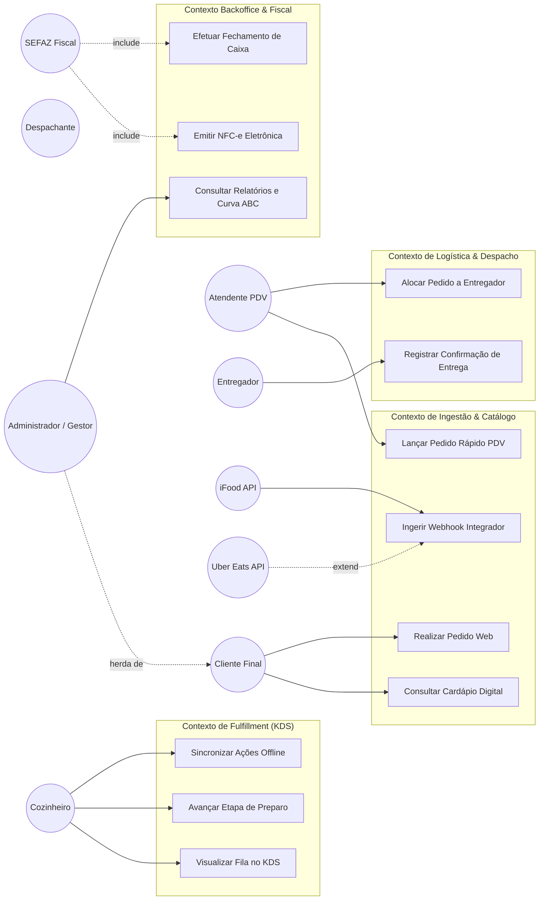

# Diagrama de Casos de Uso

## Visão Geral

O diagrama abaixo modela os casos de uso principais da Plataforma Unificada de Gestão de Delivery, incluindo atores, herança de ator, e relações `<<include>>` e `<<extend>>`.



## PlantUML Style (Notação Textual)

```
Ator: Cliente
Ator: Atendente
Ator: Cozinheiro
Ator: Despachante
Ator: Entregador
Ator: Administrador (herda de Cliente)

UC01 Consultar Cardápio Digital
UC02 Realizar Pedido Web
  <<include>> UC03 Validar Pagamento
  <<extend>> UC04 Aplicar Cupom (ponto de extensão: antes de finalizar pedido)
UC03 Lançar Pedido Rápido PDV
UC04 Ingerir Webhook Integrador
UC05 Visualizar Fila no KDS
UC06 Avançar Etapa de Preparo
UC07 Sincronizar Ações Offline
UC08 Alocar Pedido a Entregador
UC09 Registrar Confirmação de Entrega
UC10 Efetuar Fechamento de Caixa
  <<include>> UC11 Emitir NFC-e Eletrônica
UC12 Consultar Relatórios e Curva ABC
```