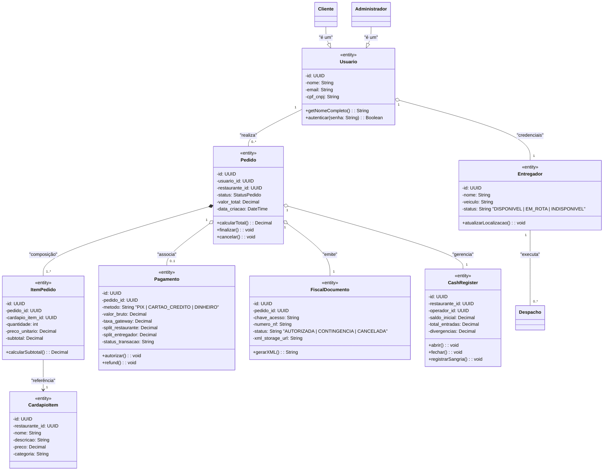

# Diagrama de Classes

## Visão do Diagrama de Classes

O diagrama abaixo extrai as classes candidatas dos substantivos dos casos de uso e requisitos, definindo atributos, métodos, visibilidade e multiplicidade nas associações.

