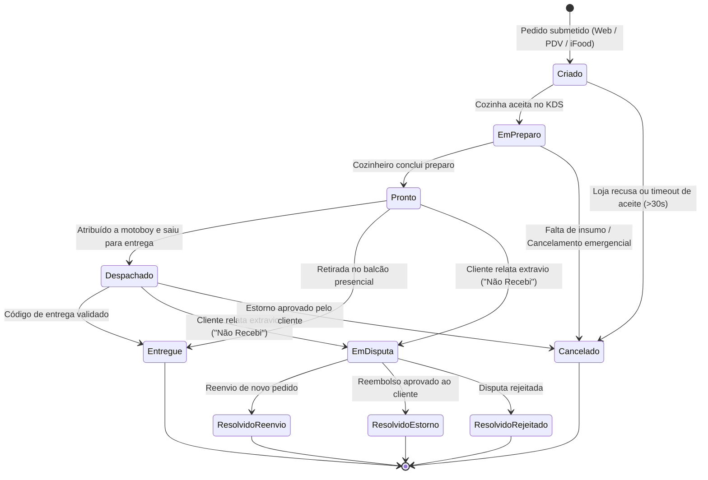

# Diagrama de Estados

## Ciclo de Vida da Entidade Pedido

A entidade **Pedido** possui um ciclo de vida complexo com múltiplos status, transições regidas por eventos e regras de quais transições são permitidas.

## Regras de Transição de Estado

| Estado Origem | Evento | Estado Destino | Condição | Responsável |
|---------------|--------|----------------|----------|-------------|
| **Criado** | `aceitar_no_kds()` | EmPreparo | Dentro do timeout de aceite (30s) | Cozinheiro |
| **Criado** | `recusar()` | Cancelado | Pedido fora de estoque | Atendente |
| **Criado** | timeout_aceite | Cancelado | Sem aceite em 30s | Sistema |
| **EmPreparo** | `concluir_preparo()` | Pronto | Todos os itens finalizados | Cozinheiro |
| **EmPreparo** | `cancelar()` | Cancelado | Problema na produção | Cozinheiro |
| **Pronto** | `despachar()` | Despachado | Entregador alocado | Sistema/Despachante |
| **Pronto** | `retirada_balcao()` | Entregue | Cliente retirou pessoalmente | Atendente |
| **Pronto** | `abrir_disputa()` | EmDisputa | Cliente reporta problema | Sistema |
| **Despachado** | `confirmar_entrega()` | Entregue | Código validado ou geolocalização | Entregador/Cliente |
| **Despachado** | `abrir_disputa()` | EmDisputa | Cliente reporta extravio | Cliente |
| **Despachado** | `estornar()` | Cancelado | Estorno aprovado | Sistema |
| **EmDisputa** | `resover_reenvio()` | ResolvidoReenvio | Reenvio aprovado | Suporte |
| **EmDisputa** | `resolver_estorno()` | ResolvidoEstorno | Estorno aprovado | Financeiro |
| **EmDisputa** | `rejeitar_disputa()` | ResolvidoRejeitado | Disputa rejeitada | Suporte |

## Observações

- Estados terminais: `Cancelado`, `Entregue`, `ResolvidoReenvio`, `ResolvidoEstorno`, `ResolvidoRejeitado`
- Transições de status devem ocorrer exclusivamente dentro da entidade de domínio via validação de FSM
- Jornada offline-first: ações offline são reconciliadas com resolução de conflitos via Vector Clocks