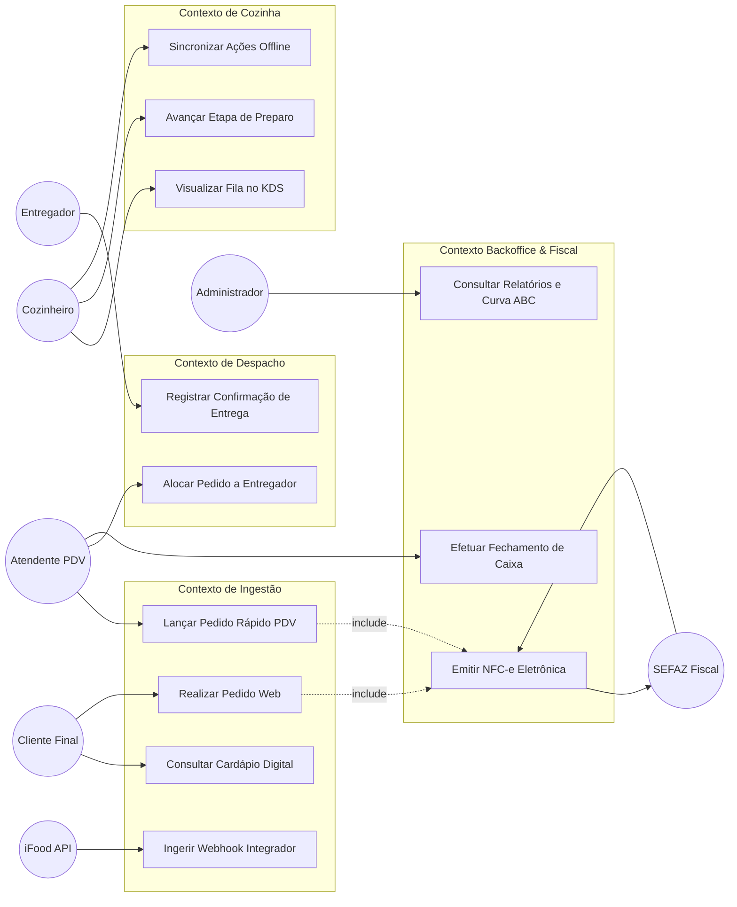
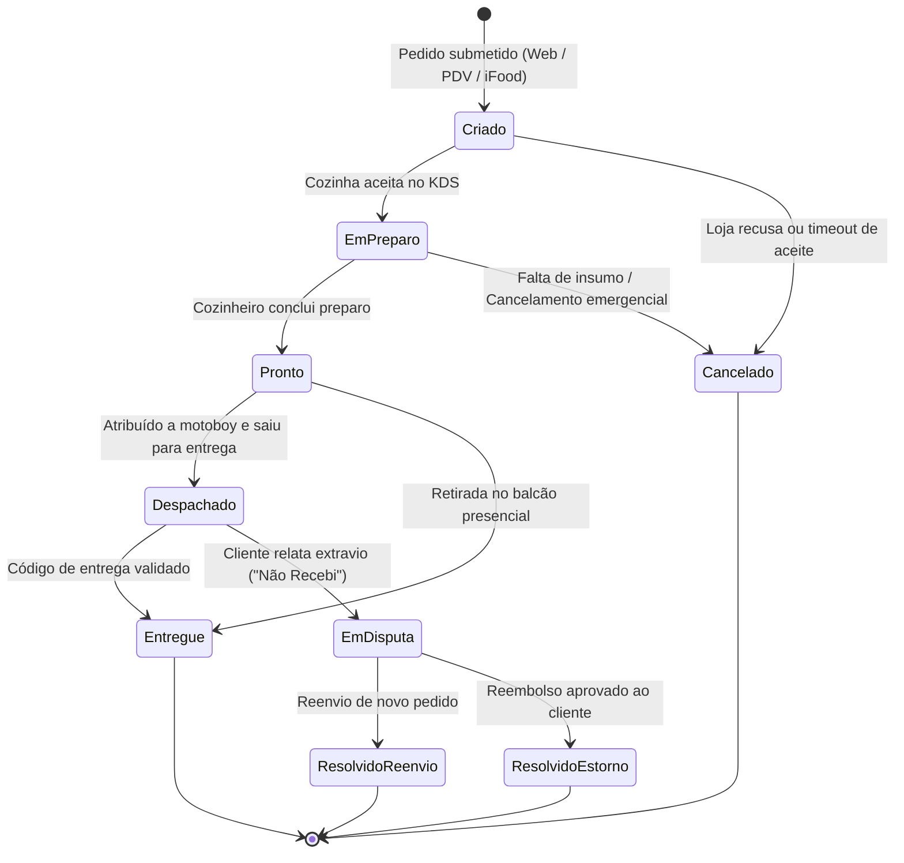
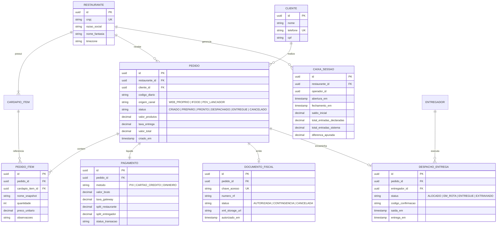
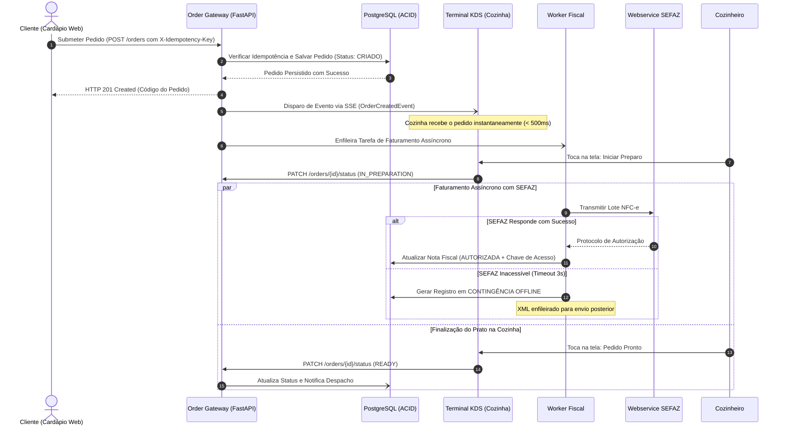
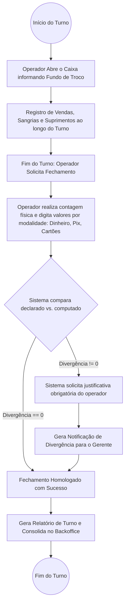
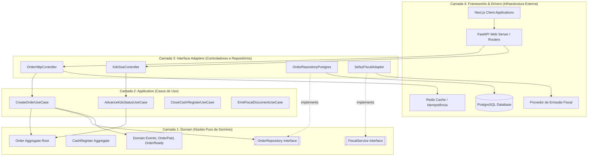

# Documento de Especificação de Software: Plataforma Unificada de Gestão de Delivery

## 8. Modelagem Visual do Sistema (Diagramas Técnicos)

### 8.1 Diagrama de Casos de Uso Geral

---

### 8.2 Diagrama de Estados do Pedido (Ciclo de Vida Completo)

---

### 8.3 Diagrama de Classes e Entidade-Relacionamento (DER Lógico)

---

### 8.4 Diagrama de Sequência: Ingestão, Preparo e Emissão Fiscal

---

### 8.5 Diagrama de Atividades: Fluxo de Caixa e Fechamento Cego

---

### 8.6 Diagrama de Componentes: Clean Architecture no Monolito Modular

