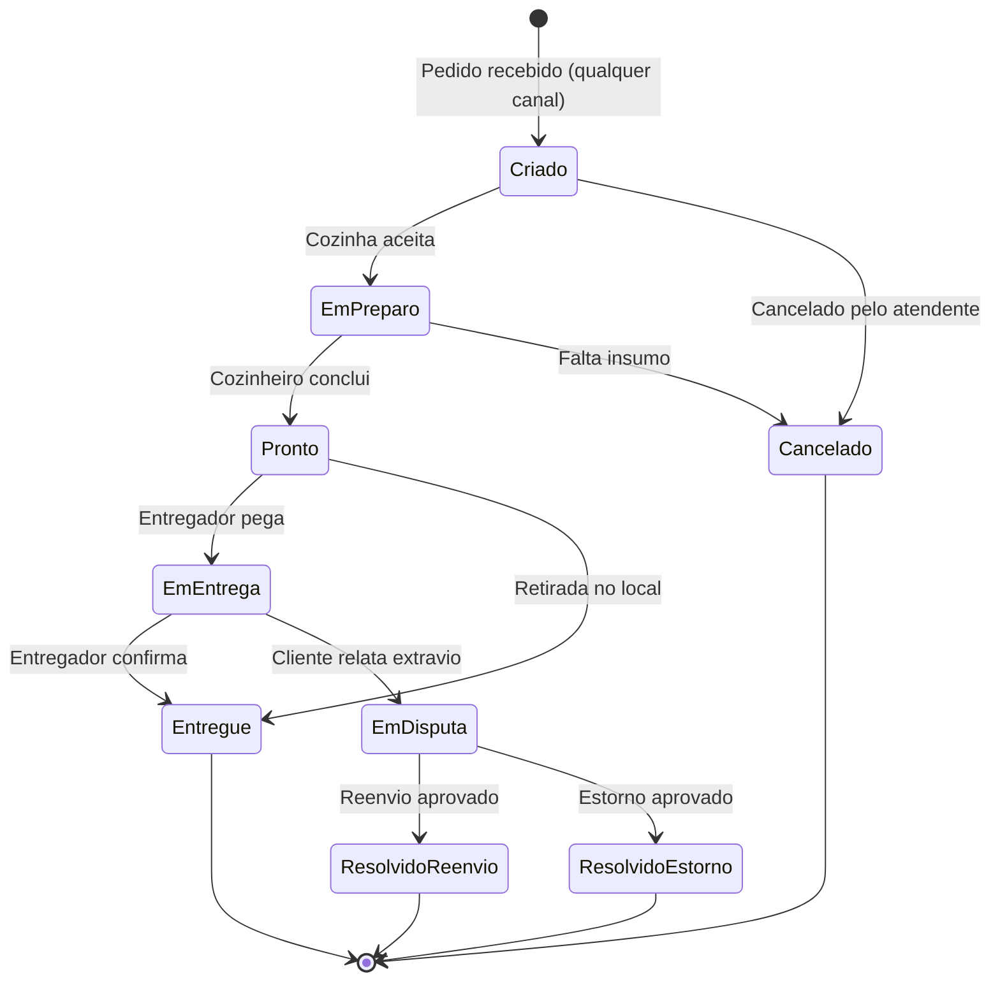
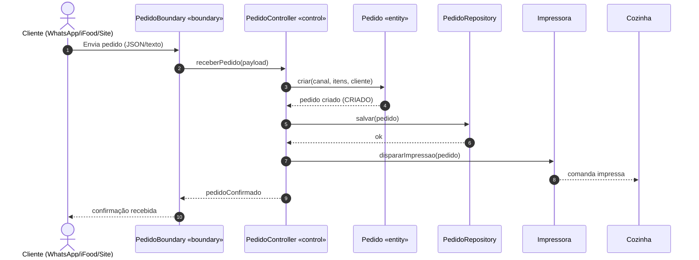
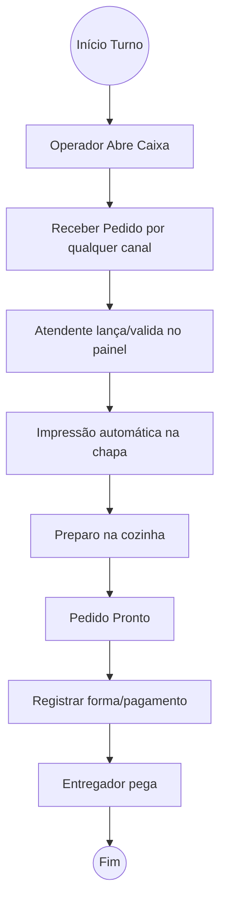
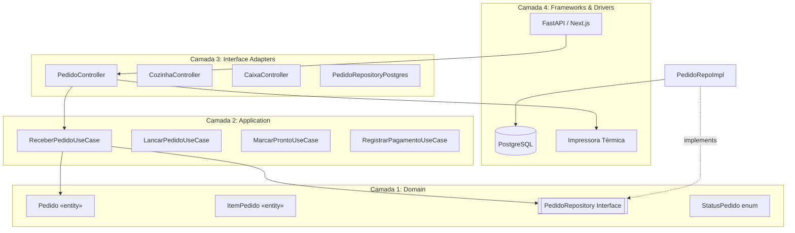

# Especificação Adaptada: Lanchonete Delivery (MVP)

## 1. Levantamento de Requisitos (RF/RNF)

### 1.1 Requisitos Funcionais

| ID | Descrição | Prioridade | Ator/Origem |
|----|-----------|-----------|-------------|
| **RF01** | O sistema deve receber pedidos de múltiplos canais (WhatsApp, iFood, site próprio, telefone) e consolidar em uma única lista de pedidos, suportando itens com complementos (ex: "sem tomate", "extra queijo"). | Alta | Ingestão / Cliente |
| **RF02** | O sistema deve permitir ao atendente lançar, editar e cancelar pedidos pelo painel, com confirmação visual de status. | Alta | Atendente |
| **RF03** | O sistema deve disparar impressão automática na chapa ao receber/atualizar pedido (via impressora térmica ou tela de cozinha). | Alta | Fulfillment / Cozinha |
| **RF04** | O sistema deve registrar forma de pagamento (Pix, cartão físico, dinheiro, crédito, link) e valor por pedido, além de registrar fiado (até 4 clientes). | Alta | Financeiro / Caixa |
| **RF05** | O sistema deve exibir relatórios completos: vendas por período, ticket médio, curva ABC, melhores clientes, histórico de fiados. | Alta | Backoffice / Gestor |
| **RF06** | O sistema deve permitir cadastro e histórico de clientes (nome, telefone, endereço, último pedido, frequência). | Média | Backoffice / Gestor |
| **RF07** | O sistema deve permitir controle de estoque básico (itens críticos: frango, lombo, refrigerantes) com alerta de baixa quantidade. | Média | Cozinha / Gestor |

### 1.2 Requisitos Não Funcionais

| ID | Categoria | Critério Mensurável e Especificação Técnica |
|----|-----------|----------------------------------------------|
| **RNF01** | Desempenho | Latência de registro de pedido < 1s; abertura do painel < 2s. |
| **RNF02** | Disponibilidade | Disponibilidade 95% para o painel web (equipe 3-5 pessoas, 1 local). |
| **RNF03** | Usabilidade | Interface adequada a 3 perfis: atendente (todas as funções), cozinha (só visualiza impressão), motoboy (confirma entrega). |
| **RNF04** | Confiabilidade (RPO)** | RPO < 1h (backup diário), RTO < 1h (restauração simples). |
| **RNF05** | Segurança | TLS 1.3, LGPD para mascaramento de dados de cliente. |
| **RNF06** | Usabilidade em Cozinha | Interface KDS adaptada: botões com área mínima de 48x48dp, contraste 4.5:1. |

---

## 2. Diagrama de Casos de Uso

```mermaid
flowchart LR
    Cliente((Cliente Final))
    Atendente((Atendente))
    Cozinheiro((Cozinheiro))
    Entregador((Entregador))
    Admin((Administrador))
    Ifood((iFood API))

    subgraph Ingestao["Contexto de Ingestão"]
        UC01[Consultar Cardápio Digital]
        UC02[Receber Pedido (todos canais)]
        UC03[Lançar Pedido Manual]
    end

    subgraph Cozinha["Contexto de Cozinha"]
        UC04[Visualizar Fila / Impressão]
        UC05[Marcar Pedido Pronto]
    end

    subgraph Logistica["Contexto de Entrega"]
        UC06[Abrir Entrega]
        UC07[Registrar Entrega]
    end

    subgraph Backoffice["Contexto Backoffice"]
        UC08[Consultar Relatórios]
        UC09[Gerenciar Cardápio]
    end

    Cliente --> UC01
    Ifood --> UC02
    Atendente --> UC03
    Atendente --> UC02
    Cozinheiro --> UC04
    Cozinheiro --> UC05
    Atendente --> UC06
    Entregador --> UC07
    Admin --> UC08
    Admin --> UC09
```

---

## 3. Diagrama de Classes (simplificado)

```mermaid
classDiagram
    class Pedido {
        -id: UUID
        -canal_origem: String
        -status: StatusPedido
        -valor_total: Decimal
        -forma_pagamento: String
        -criado_em: DateTime
        +calcularTotal(): Decimal
        +avancarStatus(): void
    }
    class ItemPedido {
        -id: UUID
        -pedido_id: UUID
        -nome_snapshot: String
        -quantidade: int
        -preco_unitario: Decimal
        +calcularSubtotal(): Decimal
    }
    class Complemento {
        -id: UUID
        -item_pedido_id: UUID
        -nome: String
        -quantidade: int
        -preco: Decimal
    }
    class Cliente {
        -id: UUID
        -nome: String
        -telefone: String
        -endereco: String
        -ultimo_pedido: DateTime
        -frequencia: int
    }
    class Pagamento {
        -id: UUID
        -pedido_id: UUID
        -metodo: String
        -valor: Decimal
        -status: String
    }
    class Entrega {
        -id: UUID
        -pedido_id: UUID
        -entregador_id: UUID
        -status: String
        -saida_em: DateTime
        -entregue_em: DateTime
    }
    class Estoque {
        -id: UUID
        -item_nome: String
        -quantidade: int
        -limite_minimo: int
        +verificarBaixa(): boolean
    }

    Cliente ||--o{ Pedido : realiza
    Pedido *-- "1..*" ItemPedido : compõe
    ItemPedido o-- "0..*" Complemento : possui
    Pedido ||--|| Pagamento : liquida
    Pedido ||--o| Entrega : encaminha
```

**Persistência**:

| Classe | Persistente? | Estratégia | Observação |
|--------|-------------|-----------|------------|
| Pedido | Sim | Tabela `pedido`, PK id | Status via FSM |
| ItemPedido | Sim | Tabela `item_pedido`, FK pedido_id | Composição |
| Complemento | Sim | Tabela `complemento`, FK item_pedido_id | Agregação |
| Cliente | Sim | Tabela `cliente`, PK id | Histórico via pedidos |
| Pagamento | Sim | Tabela `pagamento`, FK pedido_id | — |
| Entrega | Sim | Tabela `entrega`, FK pedido_id | — |
| Estoque | Sim | Tabela `estoque`, PK id | Baixa manual + alerta |

---

## 4. Diagrama de Estados (FSM do Pedido)



**Regras de transição**:
- Transações de status via FSM estrita (não permite "Pronto" sem "EmPreparo")
- Estados terminais: `Cancelado`, `Entregue`, `ResolvidoReenvio`, `ResolvidoEstorno`
- Ações offline: sincronização simples (1 local, internet estável — sem Vector Clocks)

---

## 5. Classes de Fronteira, Controle e Entidade

| Caso de Uso | Boundary | Control | Entities envolvidas |
|-------------|----------|---------|---------------------|
| Receber Pedido | PedidoBoundary (REST/Webhook) | PedidoController | Pedido, Cliente |
| Lançar Pedido | PedidoBoundary (UI) | PedidoController | Pedido, ItemPedido, Complemento |
| Visualizar Fila | CozinhaBoundary (Tela/Impressora) | PedidoController | Pedido |
| Marcar Pronto | CozinhaBoundary | PedidoController | Pedido |
| Registrar Pagamento | CaixaBoundary | PagamentoController | Pagamento, Pedido |
| Registrar Entrega | EntregaBoundary | EntregaController | Entrega, Pedido |
| Gerenciar Estoque | EstoqueBoundary | EstoqueController | Estoque |
| Gerenciar Clientes | ClienteBoundary | ClienteController | Cliente |

---

## 6. Diagrama de Sequência: Receber Pedido



---

## 7. Diagrama de Atividades: Fluxo de Caixa Simplificado



---

## 8. Diagrama de Componentes (Clean Architecture)



---

## 9. Implementação: DDD, Clean Architecture, TDD

### 9.1 Estrutura de Diretórios

```
src/
  domain/
    entities/
      Pedido.py
      ItemPedido.py
      Complemento.py
      Pagamento.py
      Entrega.py
      Cliente.py
      Estoque.py
    value_objects/
      Endereco.py
      Dinheiro.py
    ports/
      PedidoRepositoryPort.py
      ImpressoraPort.py
    exceptions/
      InvalidTransitionError.py
  application/
    use_cases/
      ReceberPedidoUseCase.py
      LancarPedidoUseCase.py
      MarcarProntoUseCase.py
      RegistrarPagamentoUseCase.py
      RegistrarEntregaUseCase.py
      GerenciarEstoqueUseCase.py
      GerenciarClienteUseCase.py
    dtos/
      PedidoDTO.py
  adapters/
    controllers/
      PedidoController.py
      CozinhaController.py
      CaixaController.py
      EstoqueController.py
      ClienteController.py
    repositories/
      PedidoRepositoryPostgres.py
      EstoqueRepositoryPostgres.py
    gateways/
      ImpressoraThermal.py
  infra/
    config/
    database/
```

### 9.2 TDD (Red → Green → Refactor)

1. **Teste unitário de domínio** — `Pedido.avancarStatus(EM_PREPARO)` deve rejeitar de CRIADO direto para PRONTO; `Estoque.verificarBaixa()` deve retornar true quando quantidade <= limite mínimo
2. **Teste de use case** — `ReceberPedidoUseCase` cria pedido com itens, complementos e persiste via fake repository
3. **Teste de integração** — `PedidoRepositoryPostgres` salva e recupera pedido com itens e complementos
4. **Teste E2E** — Fluxo: recebe pedido → imprime → marca pronto → registra pagamento → entrega → baixa estoque

Rastreabilidade: cada RF → caso de uso → teste (RF01 → ReceberPedidoUseCase → teste de criação; RF07 → GerenciarEstoqueUseCase → teste de alerta)

---

## 10. Roadmap Adaptado

### Marco 1: Core (2-3 semanas)
- Setup: Python 3.12, FastAPI, PostgreSQL, Next.js
- Domain: Pedido, ItemPedido, StatusPedido (FSM), Cliente, Estoque
- Use case: ReceberPedido, LancarPedido, MarcarPonto
- Adapter: REST API + Impressora térmica
- Testes: unitários domínio + use case

### Marco 2: Fluxos Transversais (2-3 semanas)
- Pagamento (forma + valor + fiado para 4 clientes)
- Entrega (status + entregador)
- Relatórios completos (vendas + clientes + histórico de fiados)
- Cardápio digital simples (site próprio) + suporta complementos
- Gerenciar Estoque básico (alertas de baixa quantidade)
- Gerenciar Clientes (cadastro + histórico)

### Marco 3: Consolidação (1-2 semanas)
- Teste de carga leve
- UX refinada por perfil de usuário
- Documentação e suporte
- Homologação

---

## Checklist de Entrega (SKILL.md)

- [x] Requisitos funcionais e não funcionais (tabela RF/RNF)
- [x] Diagrama de casos de uso com atores, include/extend
- [x] Diagrama de classes com composição, agregação e persistência marcada
- [x] Diagrama de objetos — omitido (cenario simples, validar em teste)
- [x] Diagrama de estados (FSM Pedido)
- [x] Classes boundary/control/entity mapeadas por caso de uso
- [x] Diagrama de sequência (Receber Pedido)
- [x] Diagrama de atividades (fluxo caixa)
- [x] Diagrama de componentes (Clean Architecture)
- [x] Mapeamento DDD (aggregates: Pedido + ItemPedido; value objects: Endereco, Dinheiro)
- [x] Estrutura de camadas Clean Architecture
- [x] Plano de testes TDD (domínio → use case → integração → e2e)

---

*Documento de Especificação Adaptada*
*Data: 11/09/2026*
*Contexto: Lanchonete/dark kitchen, 5 funcionários, 20-60 pedidos/dia*