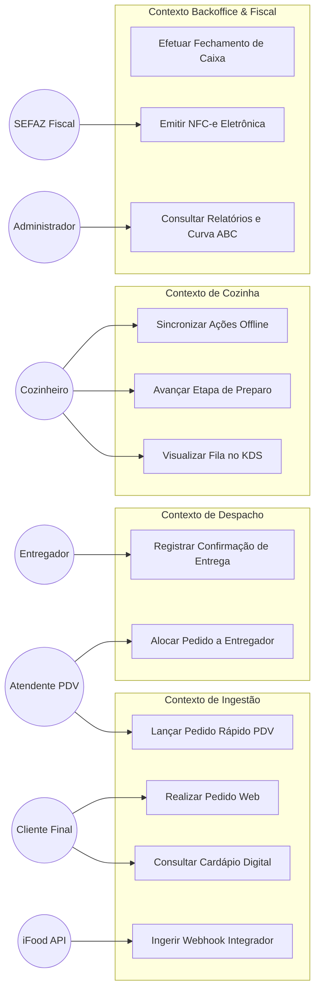
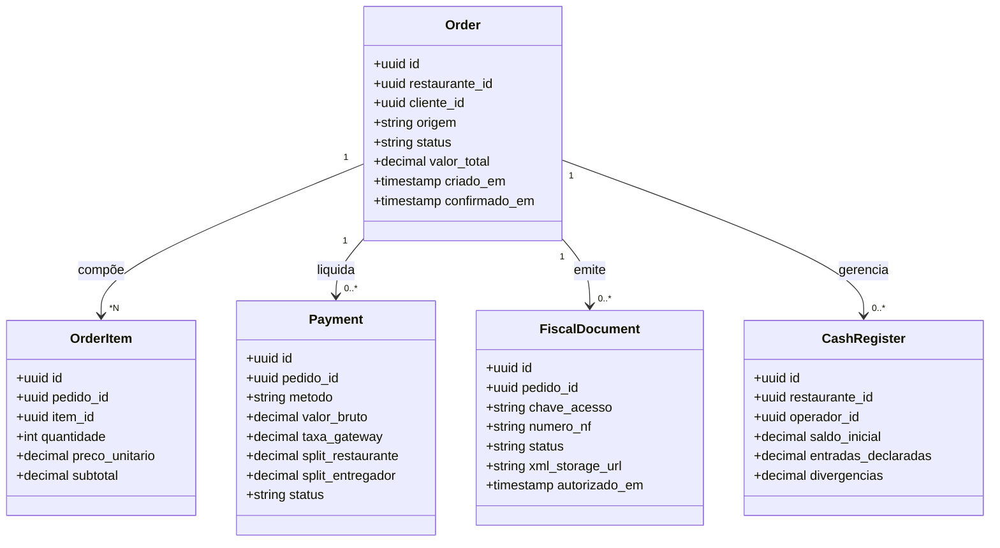
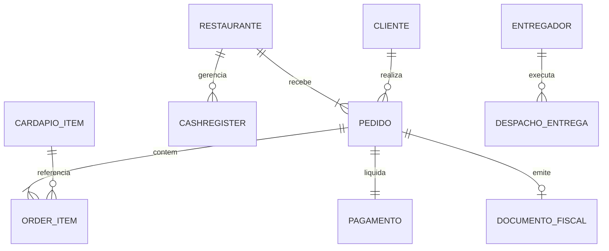
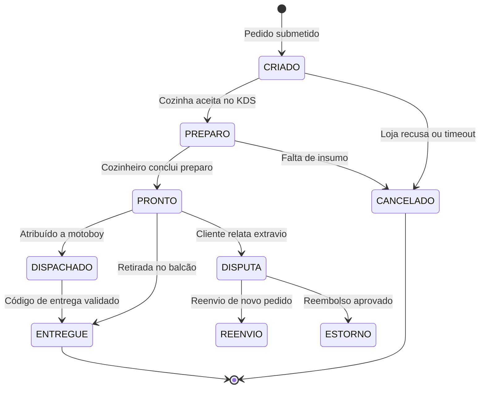
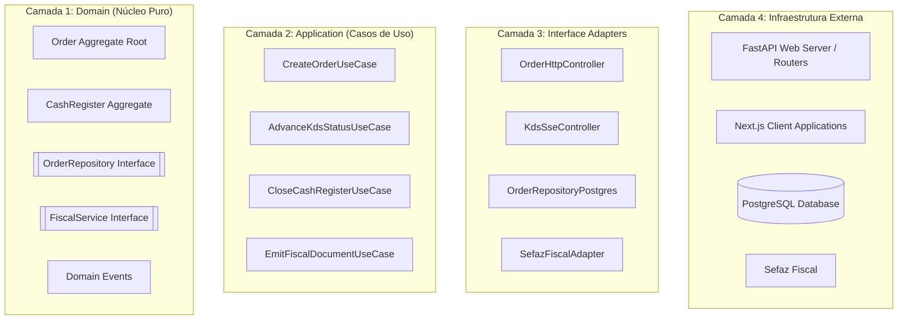

# Documento de Especificação de Software: Plataforma Unificada de Gestão de Delivery

## 1. Introdução e Visão Geral

This document serves as the definitive specification for the **Plataforma Unificada de Gestão de Delivery** (PUGD). It defines the software architecture, requirements, and technical design following Domain-Driven Design (DDD) principles and Clean Architecture patterns.

**Propósito:** Fornecer uma base única e rastreável para o desenvolvimento, implementação e manutenção do sistema de gestão de delivery.

**Escopo:** Integração de catálogo, captura de pedidos, fulfillment (preparo e entrega), gestão de caixa, emissão fiscal (NFC-e/NF-e) e monitoramento de operações.

## 2. Requisitos Funcionais (RF)

| ID | Descrição | Prioridade | Contexto / Ator |
|----|-----------|------------|-------------|
| RF01 | O sistema deve permitir ao cliente consultar o cardápio digital web categorizado, adicionar itens, personalizar adicionais/observações e submeter o pedido. | Alta | Ingestão / Cliente |
| RF02 | O sistema deve disponibilizar interface de Lançador Rápido com atalhos de teclado para registro de pedidos presenciais e telefônicos em menos de 10 segundos. | Alta | Ingestão / Atendente |
| RF03 | O sistema deve receber e consolidar webhooks de plataformas terceiras (iFood, Uber Eats) em uma fila padronizada única. | Alta | Ingestão / Sistema Externo |
| RF04 | O sistema deve rejeitar requisições de criação de pedidos com chaves de idempotência repetidas, retornando o registro original sem duplicar produção. | Alta | Ingestão / Sistema |
| RF05 | O KDS deve exibir os pedidos recebidos ordenados por ordem cronológica e criticidade de tempo, permitindo avançar status ("Em Preparo", "Pronto"). | Alta | Fulfillment / Cozinheiro |
| RF06 | O KDS deve manter operação contínua mesmo sem conexão com a internet, persistindo ações localmente e reconciliando ao restabelecer rede. | Alta | Fulfillment / Cozinheiro |
| RF07 | O sistema deve permitir ao despachante alocar um ou múltiplos pedidos prontos para um entregador credenciado. | Alta | Logística / Despachante |
| RF08 | O sistema deve registrar a confirmação de entrega através de código de validação fornecido pelo cliente ou geolocalização do entregador. | Alta | Logística / Entregador |
| RF09 | O sistema deve gerenciar o fluxo de caixa diário por operador, suportando abertura, sangrias, suprimentos e fechamento cego com cálculo de divergências. | Alta | Financeiro / Caixa |
| RF10 | O sistema deve emitir documento fiscal eletrônico (NFC-e/NF-e) perante a SEFAZ de forma assíncrona a cada pedido faturado. | Alta | Fiscal / Sistema SEFAZ |
| RF11 | O sistema deve emitir documento fiscal em contingência offline caso o webservice da SEFAZ esteja inacessível, transmitindo os lotes automaticamente após normalização. | Alta | Fiscal / Sistema |
| RF12 | O sistema deve calcular automaticamente o split financeiro de cada pedido (líquido do lojista, comissão da plataforma, taxa de entrega e desconto de MDR). | Alta | Financeiro / Sistema |
| RF13 | O sistema deve prover fluxo de contestação e disputa para pedidos não entregues ou itens incorretos, permitindo estorno total, parcial ou reenvio. | Média | Operação / Suporte |
| RF14 | O sistema deve exibir painel analítico gerencial com faturamento diário/mensal, ticket médio, horários de pico e curva ABC de produtos. | Média | Backoffice / Gestor |
| RF15 | O sistema deve fornecer ferramenta de importação e validação de cardápios legados a partir de planilhas Excel/CSV. | Média | Backoffice / Administrador |

## 3. Requisitos Não Funcionais (RNF)

| ID | Categoria | Critério Mensurável e Especificação Técnica |
|----|-----------|----------------------------------------------|
| RNF01 | Performance | Latência de resposta de API no Lançador e Cardápio inferior a 250ms sob percentil 95 (p95). |
| RNF02 | Disponibilidade | Disponibilidade de 99.99% para a tela do KDS na cozinha e 99.9% para a API central de pedidos. |
| RNF03 | Tempo Real | Propagação de eventos de novos pedidos e atualizações de status para KDS em menos de 500ms via SSE ou WebSockets. |
| RNF04 | Confiabilidade (RPO) | Ponto de Recuperação Objetivo (RPO) inferior a 5 minutos através de replicação contínua WAL no PostgreSQL. |
| RNF05 | Recuperação (RTO) | Tempo de Recuperação Objetivo (RTO) inferior a 30 minutos em caso de queda do nó primário de banco de dados. |
| RNF06 | Compliance Legal | Armazenamento de arquivos XML de notas fiscais autorizadas e canceladas por no mínimo 5 anos em storage seguro com criptografia AES-256. |
| RNF07 | Portabilidade / Vendor Lock-in | Uso estrito do padrão Adapter para todas as integrações de terceiros (gateways, SMS, mapas e emissão fiscal), permitindo substituição rápida e transparente sem impacto no domínio. |
| RNF08 | Usabilidade em Cozinha | Interface KDS adaptada a condições industriais: botões com área de toque mínima de 48x48dp, contraste de cores superior a 4.5:1 e suporte a feedback sonoro/vibratório. |
| RNF09 | Segurança | Criptografia em trânsito (TLS 1.3) para todas as comunicações e aderência à LGPD para mascaramento de dados sensíveis de clientes. |
| RNF10 | Integridade Contábil | Livro razão financeiro modelado estritamente por partidas dobradas e registros imutáveis (append-only ledger). |

## 4. Arquitetura de Software e Evolução de Paradigmas

### 4.1 Abordagem Arquitetural

A solução adota **Monolito Modular** na Fase 1 (MVP), evoluindo para **Microserviços Orientados a Eventos** na Fase 2 e **Cell-Based Architecture** na Fase 3.

#### Fase 1: Monolito Modular (Clean Architecture)
- Estrutura: Um único binário executável com separação rígida por domínios no código-fonte.
- Vantagem: Operações críticas (cancelamento de pedido) executadas em transações ACID atômicas.
- Tecnologia: Python 3.12+, FastAPI, PostgreSQL, Redis.

#### Fase 2: Microsserviços com Eventos (Outbox Pattern)
- Separação física dos contextos delimitados em serviços independentes.
- Comunicação via mensageria assíncrona (RabbitMQ/Kafka) com Transactional Outbox Pattern para consistência eventual.

#### Fase 3: Cell-Based Architecture
- Divisão em células estanques e autossuficientes por polo de atendimento.
- Isolamento de falhas e escalabilidade horizontal.

### 4.2 Stack Tecnológica
- **Backend Core:** Python 3.12+ (Zero dependencies no coração das regras de negócio)
- **API:** FastAPI (async, OpenAPI automático)
- **Frontend:** Next.js 14+ (App Router), TypeScript, Tailwind CSS
- **Banco de Dados:** PostgreSQL 16+ (particionamento por data/tenant)
- **Cache/Fila:** Redis 7+ (idempotência, rate-limiting, SSE)
- **Validação:** Pydantic v2

## 5. Modelagem de Domínio (DDD)

### 5.1 Glossário da Linguagem Ubíqua
- **Lançador:** Interface de entrada rápida no PDV balcão
- **Cardápio Digital:** Web app responsivo de autoatendimento
- **KDS:** Terminal de tela na cozinha (Kitchen Display System)
- **Praça:** Estação de trabalho física na cozinha
- **Despacho:** Módulo operacional de atribuição e tracking
- **Caixa / PDV:** Controle de movimentação financeira
- **Fechamento Cego:** Processo de fechamento de caixa sem visão direta
- **Ticket Médio:** Faturamento líquido dividido por pedido
- **Curva ABC:** Classificação estatística de produtos

### 5.2 Entidades de Domínio

| Entidade | Responsabilidade | Atributos Chave |
|----------|------------------|-----------------|
| **Order** | Aggregate Root (Pedido) | id, restaurante_id, cliente_id, origem, status, valor_total, data_criado, data_confirmado |
| **OrderItem** | Parte do pedido | id, pedido_id, item_id, quantidade, preco_unitario, subtotal |
| **CashRegister** | Aggregate (Caixa) | id, restaurante_id, operador_id, saldo_inicial, entradas_declaradas, divergencias |
| **Payment** | Representa transações financeiras | id, pedido_id, metodo, valor_bruto, taxa_gateway, split_restaurante, split_entregador, status |
| **FiscalDocument** | Documento fiscal (NFC-e/NF-e) | id, pedido_id, chave_acesso, numero_nf, status, xml_storage_url, autorizado_em |
| **Dispute** | Fluxo de contestação | id, pedido_id, motivo, status, resolucao |

### 5.3 Persistência
- **Entidades Persistentes:** Order, OrderItem, CashRegister, Payment, FiscalDocument
- **Estratégia:** Tabelas PostgreSQL com PK auto-generadas
- **Observação:** Agregados (Order, OrderItem) devem ser persistidos como unidade atômica

## 6. Diagramas Técnicos

### 6.1 Diagrama de Casos de Uso (UML)



### 6.2 Diagrama de Classes (UML)



### 6.3 Diagrama Entidade-Relacionamento (ERD)



### 6.4 Diagrama de Estados (UML)



### 6.5 Diagrama de Componentes (Clean Architecture)



## 7. Implementação: DDD, Clean Architecture e TDD

### 7.1 Estrutura de Diretórios

```
src/
├── domain/
│   ├── entities/
│   │   ├── Order.java
│   │   ├── OrderItem.java
│   │   ├── CashRegister.java
│   │   └── Payment.java
│   ├── value_objects/
│   │   ├── Money.java
│   │   ├── CPF CNPJ.java
│   │   └── Address.java
│   ├── ports/
│   │   ├── OrderRepositoryPort.java
│   │   ├── FiscalPort.java
│   │   └── PaymentPort.java
│   └── exceptions/
│       └── DomainExceptions.java
├── application/
│   ├── use_cases/
│   │   ├── CreateOrderUseCase.java
│   │   ├── AdvanceKdsStatusUseCase.java
│   │   ├── CloseCashRegisterUseCase.java
│   │   └── EmitFiscalDocUseCase.java
│   └── dtos/
│       ├── OrderDTO.java
│       └── KdsDTO.java
├── adapters/
│   ├── controllers/
│   │   ├── OrderController.java
│   │   └── KdsController.java
│   ├── repositories/
│   │   └── OrderRepositoryPostgres.java
│   └── gateways/
│       ├── TechSpeedFiscalAdapter.java
│       └── TwilioSmsAdapter.java
└── infra/
    ├── config/
    ├── database/
    └── workers/
```

### 7.2 Estratégia de Testes (TDD)

1. **Testes Unitários de Domínio** – Valida regras intrínsecas das entidades (cálculo de descontos, transições de status, split financeiro).
2. **Testes de Casos de Uso** – Orquestração usando In-Memory Repositories, garantindo coordenação entre entidades e persistência correta.
3. **Testes de Integração** – Contra instâncias de teste do PostgreSQL (testcontainers), validando queries de agregação e integridade relacional.
4. **Testes E2E Críticos** – Fluxo completo: criação de pedido via API → chegada no SSE do KDS → mudança para "Pronto" → registro fiscal gerado.

## 8. Planejamento de Implementação

### Fase 1: MVP Essencial (Semanas 1-8)
- Arquitetura Monolito Modular com Clean Architecture
- Interface Lançador Rápido com atalhos de teclado
- Cardápio Digital Web (PWA responsivo)
- KDS com WebSockets/SSE e persistência local (IndexedDB)
- Controle de Caixa básico (abertura, sangrias, fechamento cego)
- Emissão de NFC-e com contingência offline

### Fase 2: Expansão Operacional (Semanas 9-16)
- Módulo completo de Despacho com rastreamento de entregadores
- Ingestor de webhooks unificado (iFood, Uber Eats)
- Painel de relatórios analíticos (Curva ABC, Ticket Médio)
- Workflow automatizado para disputas de clientes
- Testes do Lançador Assistido com IA

### Fase 3: Escala e Robustez (Semanas 17-24)
- Avaliação de desacoplamento para microsserviços (Outbox Pattern)
- Split de pagamento automatizado com adquirentes
- Preparação de Cell-Based Architecture
- Auditoria de conformidade contínua

## 9. Checklist de Entrega

- [ ] Requisitos funcionais e não funcionais documentados (tabela RF/RNF)
- [ ] Diagrama de casos de uso com atores, herança e include/extend
- [ ] Diagrama de classes com composição, agregação e herança
- [ ] Marcação de persistência das entidades (tabelas no ERD)
- [ ] Diagrama de objetos (instanciais) validando cardinalidades
- [ ] Diagrama de estados para entidades com ciclo de vida complexo
- [ ] Classes de fronteira/controle/entidade mapeadas por caso de uso
- [ ] Diagrama de sequência para fluxos críticos (ingestão, preparo, fiscal)
- [ ] Diagrama de componentes (Clean Architecture)
- [ ] Plano de testes TDD (unitários → integração → E2E)
- [ ] Documentação de SLAs e métricas de performance

## 10. Conclusão

A especificação apresentada define claramente os requisitos, a arquitetura técnica e o plano de implementação para a Plataforma Unificada de Gestão de Delivery. O foco está em resolver problemas operacionais reais (redução de tablets, eliminação de retrabalho, conformidade fiscal) através de uma solução robusta, escalável e fácil de operar no ambiente de cozinha real.

**Próximos Passos:**
1. Validação da estrutura do documento com a equipe de produto
2. Kickoff da Fase 1 (MVP) com formação da equipe de desenvolvimento
3. Configuração do ambiente de desenvolvimento e CI/CD
4. Implementação do Monolito Modular com as primeiras entidades (Order, OrderItem, CashRegister)

---

*Documento de Especificação - Versão 2.0*
*Data: 04/09/2026*
*Responsável: Equipe de Software*