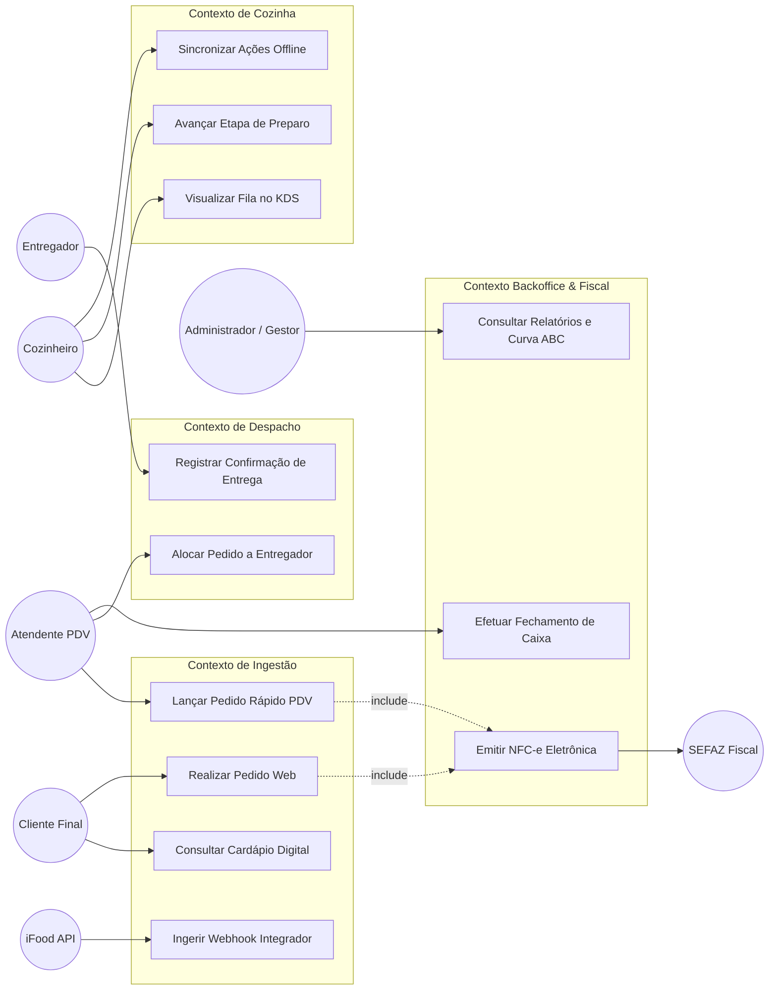
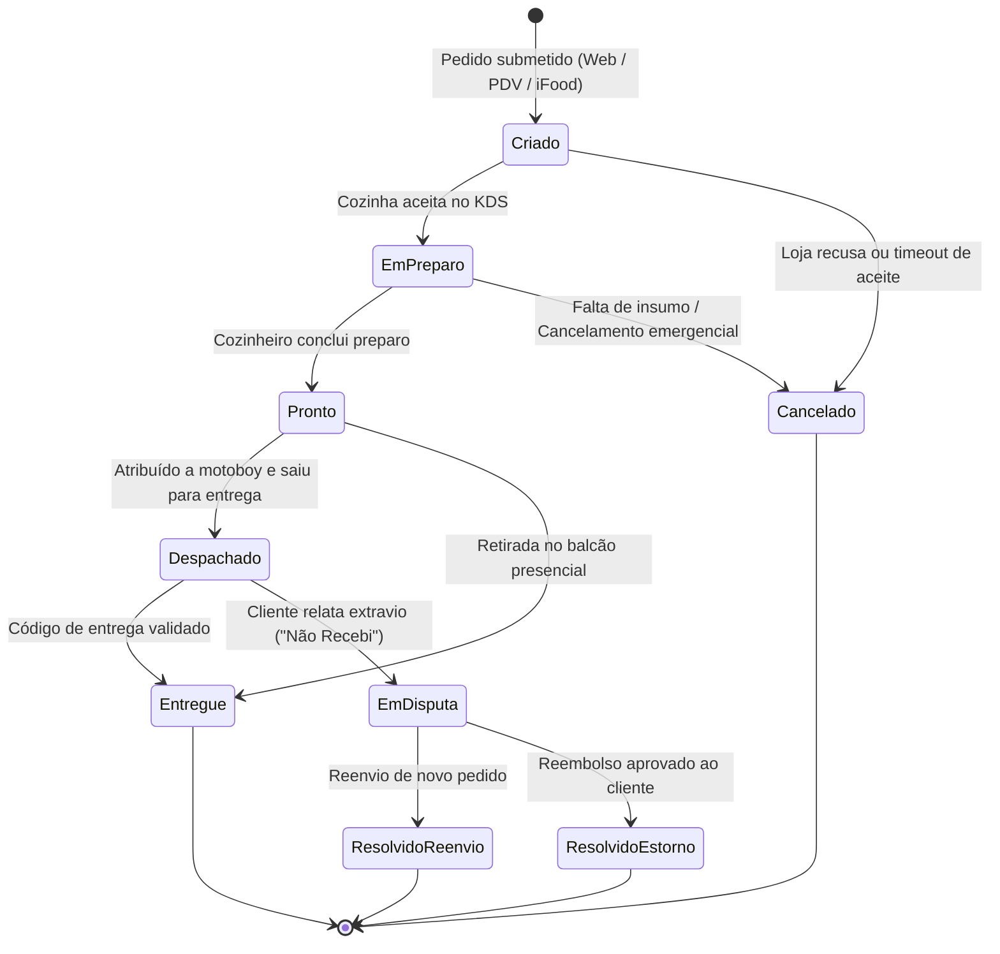
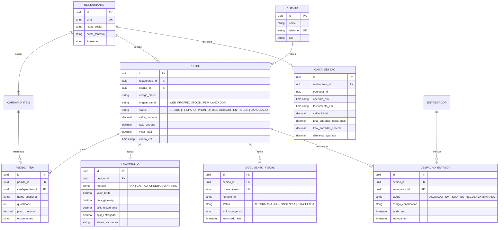
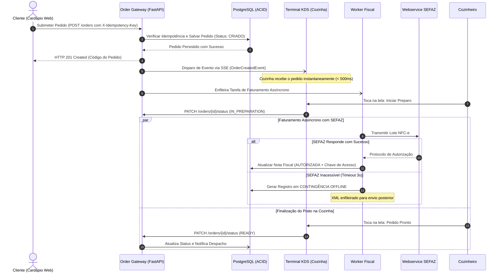
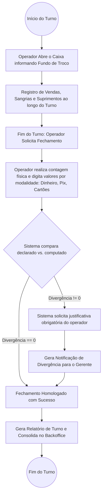
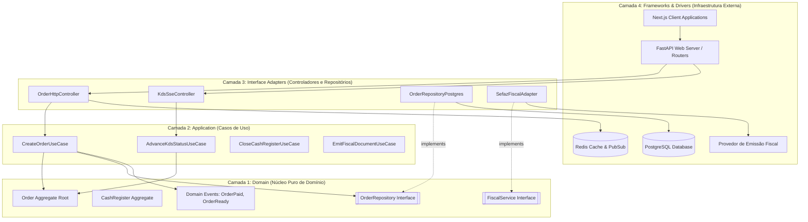

# Especificação Completa e Documento de Ideação: Plataforma Unificada de Gestão de Delivery

> **Documento Mestre Unificado**  
> *Versão:* 2.0 (Consolidada)  
> *Status:* Aprovado para Execução  
> *Data de Atualização:* 04/09/2026  
> *Escopo:* Ideação, Arquitetura de Software, Modelagem DDD, Requisitos, Resolução de Lacunas Críticas, Diagramas Técnicos e Roadmap de Implementação.

---

## 📋 Sumário Executivo

1. [Visão Geral & Proposta de Valor](#1-visão-geral--proposta-de-valor)
2. [Modelagem de Domínio (DDD) & Linguagem Ubíqua](#2-modelagem-de-domínio-ddd--linguagem-ubíqua)
3. [Engenharia de Requisitos (RF e RNF)](#3-engenharia-de-requisitos-rf-e-rnf)
4. [Arquitetura de Software & Evolução de Paradigmas](#4-arquitetura-de-software--evolução-de-paradigmas)
5. [Decisões Críticas de Engenharia](#5-decisões-críticas-de-engenharia)
6. [Resolução das 10 Lacunas Críticas de Operação & Negócio](#6-resolução-das-10-lacunas-críticas-de-operação--negócio)
7. [Inovação e Inteligência Artificial Pragmática](#7-inovação-e-inteligência-artificial-pragmática)
8. [Modelagem Visual do Sistema (Diagramas Técnicos Mermaid)](#8-modelagem-visual-do-sistema-diagramas-técnicos-mermaid)
9. [Estratégia de Implementação e Qualidade (Clean Arch & TDD)](#9-estratégia-de-implementação-e-qualidade-clean-arch--tdd)
10. [Roadmap de Execução, Fases e Matriz de Riscos](#10-roadmap-de-execução-fases-e-matriz-de-riscos)

---

## 1. Visão Geral & Proposta de Valor

### 1.1 O Problema Operacional Real
A operação diária de um delivery de alimentação enfrenta um cenário de caos operacional e descentralização tecnológica:
- **Proliferação de Telas e Tablets**: Múltiplos dispositivos dedicados sobre o balcão (iFood, Rappi, WhatsApp comercial, telefone), gerando aluguel de equipamentos (R$ 150 a R$ 300/tablet/mês por canal) e poluição física no ponto de venda.
- **Dupla Digitação e Retrabalho Humano**: Atendentes precisam transcrever manualmente pedidos recebidos em marketplaces para o PDV interno ou para a comanda de papel, causando erros de pedidos em horários de pico (taxa de retrabalho entre 3% e 7%).
- **Falta de Visibilidade em Tempo Real**: Cozinha desconhece a carga real de trabalho acumulada em múltiplos canais, enquanto a equipe de despacho distribui entregadores sem visibilidade de rota ou capacidade de carga.
- **Cegueira Gerencial e Fisco**: Fechamentos de caixa demorados, perda de conciliação entre repasses das plataformas e a realidade contábil, além de vulnerabilidade legal por falhas na emissão obrigatória de NFC-e/NF-e sob contingência.

### 1.2 A Solução: Ecossistema Unificado
Um ecossistema digital integrado, de alta confiabilidade e baixa fricção, sustentado por três pilares:
1. **Captura (Order Gateway)**: Cardápio digital web para canal próprio (focado em conversão e zero comissões abusivas) combinado com agregador de pedidos externos (iFood, Uber Eats, WhatsApp) e um Lançador de alta velocidade para o balcão.
2. **Operação (Fulfillment & Logistics)**: Sistema de Exibição de Cozinha (KDS - *Kitchen Display System*) resiliente com suporte offline-first, sincronizado a um módulo de Despacho dinâmico com gestão de entregadores e tracking de pedidos.
3. **Reconciliação (Backoffice & Fiscal)**: Fechamento cego de caixa, conciliação de taxas de intermediadores, split de pagamentos, compliance fiscal automático (NFC-e) e inteligência analítica de faturamento e curva ABC.

### 1.3 Framework de Retorno Sobre o Investimento (ROI)

| Alavanca de Valor | Métrica de Impacto | Fonte de Dados | Impacto Estimado na Operação |
| :--- | :--- | :--- | :--- |
| **Eliminação de Tablets** | Redução de custo fixo | Contratos de locação/equipamento | Economia de R$ 300 a R$ 600 / mês |
| **Deduplicação e Zero Retrabalho** | Queda de cancelamentos e perdas | Histórico de refações e estornos | Economia de R$ 1.200 a R$ 2.500 / mês em insumos |
| **Cardápio Próprio (Autoatendimento)** | Economia de comissão (12% a 27%) | Relatório de vendas marketplace | Retenção de margem líquida direta no faturamento |
| **Otimização de Despacho** | Redução de tempo ocioso de motoboys | Relatório de corridas por turno | Aumento na capacidade e agilidade de entregas |

#### Viabilidade Econômica Direta
- **Eliminação Imediata de Custos Recorrentes**: Redução de despesas com hardware e taxas de aluguel de tablets externos.
- **Eficiência de Produção**: Redução drástica de desperdício e refação de pratos provocados por falhas de transcrição manual de pedidos.
- **Rentabilidade por Canal**: Ganhos por upsell automatizado no cardápio próprio e retenção da margem que seria repassada em comissões a intermediários.
- **Retorno do Investimento**: O ganho de eficiência operacional e a recuperação de margem proporcionam retorno econômico perceptível logo nos primeiros ciclos de operação plena.

---

## 2. Modelagem de Domínio (DDD) & Linguagem Ubíqua

O projeto adota estritamente os princípios do **Domain-Driven Design (DDD)** para blindar a regra de negócio contra volatilidades tecnológicas e garantir consistência semântica em toda a equipe.

### 2.1 Glossário da Linguagem Ubíqua (Ubiquitous Language)
- **Lançador**: Interface de entrada rápida no PDV balcão, permitindo que o atendente registre um pedido presencial ou telefônico em menos de 10 segundos, com navegação primária via teclado e atalhos numéricos.
- **Cardápio Digital**: Web app responsivo de autoatendimento para o consumidor final, acessível sem necessidade de download na App Store/Play Store.
- **KDS (Kitchen Display System)**: Terminal de tela na cozinha que exibe a fila de preparação, organiza os pedidos por tempo de praça e permite avanço visual de estados do prato.
- **Praça**: Estação de trabalho física na cozinha (ex: "Chapa", "Fritura", "Montagem", "Bebidas").
- **Despacho**: Módulo operacional responsável por agrupar pedidos prontos, atribuí-los a um motoboy disponível e calcular a ordem de entrega.
- **Caixa / PDV**: Controle de movimentação financeira por turno (abertura, sangrias, suprimentos e fechamento cego de caixa).
- **Fechamento Cego**: O operador declara o valor em dinheiro e cartões sem ver o total calculado pelo sistema, evitando desvios.
- **Ticket Médio**: Razão matemática entre o faturamento líquido total e o número de pedidos finalizados com sucesso no período.
- **Curva ABC**: Classificação estatística dos produtos com base no faturamento (Classe A = ~80% do faturamento, Classe B = ~15%, Classe C = ~5%).

### 2.2 Contextos Delimitados (Bounded Contexts)

```
┌────────────────────────────────────────────────────────────────────────┐
│                        ECOSSISTEMA WEB DELIVERY                        │
└────────────────────────────────────────────────────────────────────────┘
       │                                     │
       ▼                                     ▼
┌─────────────────────────┐           ┌─────────────────────────┐
│       INGESTÃO &        │           │       FULFILLMENT       │
│    CATÁLOGO (GATEWAY)   │           │          (KDS)          │
│ - Cardápio Digital      │           │ - Fila de Cozinha       │
│ - Lançador Rápido (PDV) │           │ - Controle por Praça    │
│ - Webhooks Agregadores  │           │ - Alertas de Tempo      │
│ - Gestão de Cardápio    │           │ - Modo Offline-First    │
└─────────────────────────┘           └─────────────────────────┘
       │                                     │
       │                   ┌─────────────────┘
       ▼                   ▼
┌─────────────────────────┐           ┌─────────────────────────┐
│   LOGÍSTICA & DESPACHO  │           │       BACKOFFICE &      │
│ - Gestão de Entregadores│           │       FINANCEIRO        │
│ - Alocação e Rotas      │           │ - Fechamento de Caixa   │
│ - Tracking de Entrega   │           │ - Emissão Fiscal NFC-e  │
│ - Prova de Entrega      │           │ - Conciliação & Split   │
│ - Gestão de Disputas    │           │ - Métricas & Curva ABC  │
└─────────────────────────┘           └─────────────────────────┘
```

1. **Contexto de Ingestão & Catálogo (Order Gateway)**:
   - *Responsabilidade*: Recepção de pedidos (cardápio web próprio, webhook iFood, entrada manual no Lançador).
   - *Regra Chave*: Validação de idempotência imediata no momento da chegada para evitar pedidos duplicados por retentativas de rede.

2. **Contexto de Fulfillment (KDS)**:
   - *Responsabilidade*: Orquestração do preparo, divisão dos itens do pedido por praças de produção, controle de tempos limite e sinalização de pratos prontos.
   - *Regra Chave*: Autonomia total local via arquitetura offline-first (IndexedDB), garantindo que a cozinha nunca pare de operar se a conexão externa cair.

3. **Contexto de Logística & Despacho**:
   - *Responsabilidade*: Atribuição de pedidos embalados a entregadores, validação de capacidade de transporte (bag), rastreamento do trajeto e coleta de confirmação de entrega (assinatura/código/foto).
   - *Regra Chave*: Tolerância a atrasos de sinal GPS móvel utilizando máquina de estados para ordenação temporal de eventos.

4. **Contexto de Backoffice, Financeiro & Fiscal**:
   - *Responsabilidade*: Apuração contábil em partidas dobradas, split de pagamentos (restaurante, plataforma, taxa de entrega e MDR de cartão), emissão assíncrona de documentos fiscais (NFC-e/NF-e) com contingência legal e consolidação analítica.
   - *Regra Chave*: Imutabilidade de lançamentos contábeis. Ajustes operacionais geram eventos compensatórios, nunca alterações destrutivas no histórico.

---

## 3. Engenharia de Requisitos (RF e RNF)

### 3.1 Requisitos Funcionais (RF)

| ID | Descrição do Requisito | Prioridade | Contexto / Ator |
| :--- | :--- | :--- | :--- |
| **RF01** | O sistema deve permitir ao cliente consultar o cardápio digital web categorizado, adicionar itens, personalizar adicionais/observações e submeter o pedido. | Alta | Ingestão / Cliente |
| **RF02** | O sistema deve disponibilizar interface de Lançador Rápido com atalhos de teclado para registro de pedidos presenciais e telefônicos em menos de 10 segundos. | Alta | Ingestão / Atendente |
| **RF03** | O sistema deve receber e consolidar webhooks de plataformas terceiras (iFood, Uber Eats) em uma fila padronizada única. | Alta | Ingestão / Sistema Externo |
| **RF04** | O sistema deve rejeitar requisições de criação de pedidos com chaves de idempotência repetidas, retornando o registro original sem duplicar produção. | Alta | Ingestão / Sistema |
| **RF05** | O KDS deve exibir os pedidos recebidos ordenados por ordem cronológica e criticidade de tempo, permitindo avançar status ("Em Preparo", "Pronto"). | Alta | Fulfillment / Cozinheiro |
| **RF06** | O KDS deve manter operação contínua mesmo sem conexão com a internet, persistindo ações localmente e reconciliando ao restabelecer rede. | Alta | Fulfillment / Cozinheiro |
| **RF07** | O sistema deve permitir ao despachante alocar um ou múltiplos pedidos prontos para um entregador credenciado. | Alta | Logística / Despachante |
| **RF08** | O sistema deve registrar a confirmação de entrega através de código de validação fornecido pelo cliente ou geolocalização do entregador. | Alta | Logística / Entregador |
| **RF09** | O sistema deve gerenciar o fluxo de caixa diário por operador, suportando abertura, sangrias, suprimentos e fechamento cego com cálculo de divergências. | Alta | Financeiro / Caixa |
| **RF10** | O sistema deve emitir documento fiscal eletrônico (NFC-e/NF-e) perante a SEFAZ de forma assíncrona a cada pedido faturado. | Alta | Fiscal / Sistema SEFAZ |
| **RF11** | O sistema deve emitir documento fiscal em contingência offline caso o webservice da SEFAZ esteja inacessível, transmitindo os lotes automaticamente após normalização. | Alta | Fiscal / Sistema |
| **RF12** | O sistema deve calcular automaticamente o split financeiro de cada pedido (líquido do lojista, comissão da plataforma, taxa de entrega e desconto de MDR). | Alta | Financeiro / Sistema |
| **RF13** | O sistema deve prover fluxo de contestação e disputa para pedidos não entregues ou itens incorretos, permitindo estorno total, parcial ou reenvio. | Média | Operação / Suporte |
| **RF14** | O sistema deve exibir painel analítico gerencial com faturamento diário/mensal, ticket médio, horários de pico e curva ABC de produtos. | Média | Backoffice / Gestor |
| **RF15** | O sistema deve fornecer ferramenta de importação e validação de cardápios legados a partir de planilhas Excel/CSV. | Média | Backoffice / Administrador |

### 3.2 Requisitos Não Funcionais (RNF)

| ID | Categoria | Critério Mensurável e Especificação Técnica |
| :--- | :--- | :--- |
| **RNF01** | **Performance** | Latência de resposta de API no Lançador e Cardápio inferior a 250ms sob percentil 95 (p95). |
| **RNF02** | **Disponibilidade** | Disponibilidade de 99.99% para a tela do KDS na cozinha e 99.9% para a API central de pedidos. |
| **RNF03** | **Tempo Real** | Propagação de eventos de novos pedidos e atualizações de status para KDS em menos de 500ms via SSE ou WebSockets. |
| **RNF04** | **Confiabilidade (RPO)** | Ponto de Recuperação Objetivo (RPO) inferior a 5 minutos através de replicação contínua WAL no PostgreSQL. |
| **RNF05** | **Recuperação (RTO)** | Tempo de Recuperação Objetivo (RTO) inferior a 30 minutos em caso de queda do nó primário de banco de dados. |
| **RNF06** | **Compliance Legal** | Armazenamento de arquivos XML de notas fiscais autorizadas e canceladas por no mínimo 5 anos em storage seguro com criptografia AES-256. |
| **RNF07** | **Portabilidade / Vendor Lock-in** | Uso estrito do padrão Adapter para todas as integrações de terceiros (gateways, SMS, mapas e emissão fiscal), permitindo substituição rápida e transparente sem impacto no domínio. |
| **RNF08** | **Usabilidade em Cozinha** | Interface KDS adaptada a condições industriais: botões com área de toque mínima de 48x48dp, contraste de cores superior a 4.5:1 e suporte a feedback sonoro/vibratório. |
| **RNF09** | **Segurança** | Criptografia em trânsito (TLS 1.3) para todas as comunicações e aderência à LGPD para mascaramento de dados sensíveis de clientes. |
| **RNF10** | **Integridade Contábil** | Livro razão financeiro modelado estritamente por partidas dobradas e registros imutáveis (append-only ledger). |

---

## 4. Arquitetura de Software & Evolução de Paradigmas

A estratégia de engenharia do projeto rejeita a imposição prematura de complexidade distribuída. O sistema é estruturado em fases de maturidade técnica e volume de negócio.

### 4.1 Análise Comparativa de Abordagens Arquiteturais

```
  [ Fase 1: MVP ]                      [ Fase 2: Escala ]                    [ Fase 3: Alta Escala ]
┌─────────────────────────┐          ┌─────────────────────────┐          ┌─────────────────────────┐
│     MONOLITO MODULAR    │          │     MICROSSERVIÇOS      │          │       CELL-BASED        │
│   (Clean Architecture)  │   ───▶   │  (Orientado a Eventos)  │   ───▶   │     (ALTA ROBUSTEZ)     │
│ - Transações ACID       │          │ - Bounded Contexts      │          │ - Clusters por Região   │
│ - Banco Único (Schemas) │          │ - Kafka / RabbitMQ      │          │ - Isolamento de Falhas  │
│ - Simplicidade de Deploy│          │ - Outbox Pattern & Sagas│          │ - Bulkhead Pattern      │
└─────────────────────────┘          └─────────────────────────┘          └─────────────────────────┘
```

#### Abordagem 1: O Monolito Modular (Fase 1 - Escolha Inicial Pragmática)
Para a ampla maioria das operações de delivery, um Monolito Modular bem estruturado com Clean Architecture é a melhor decisão de engenharia.
- **Estrutura**: Um único binário executável e um banco relacional PostgreSQL, porém com isolamento rígido por domínios no código-fonte. O módulo de Logística jamais faz JOIN na tabela do módulo de Pedidos; a comunicação ocorre estritamente via interfaces e contratos de domínio interno.
- **Vantagem Vital (Transações ACID)**: Operações críticas como cancelamento de pedido (estorno financeiro + reposição de estoque + cancelamento de despacho) são executadas em uma única transação atômica de banco de dados (`BEGIN ... COMMIT`). Se houver falha, o rollback é instantâneo.
- **Mitigação de Riscos**: Implementação de testes de arquitetura (usando linters de dependência em Python, como `import-linter` ou regras pytest) para impedir acoplamento indevido entre módulos.

#### Abordagem 2: Microsserviços Orientados a Eventos (Fase 2 - Escala e Alta Carga)
Aplicada quando o volume de requisições de leitura (dashboards e catálogo) ameaça a estabilidade dos módulos de escrita operacional de baixa latência (KDS e Ingestão).
- **Estrutura**: Separação física dos contextos delimitados em serviços independentes com bancos próprios, comunicando-se via mensageria assíncrona (RabbitMQ ou Apache Kafka).
- **Trade-off Crítico (Consistência Eventual)**: Atrasos no processamento de filas de estoque podem resultar na venda de produtos esgotados. Torna-se obrigatório o desenvolvimento de rotinas automáticas de compensação (estorno e comunicação proativa ao cliente).
- **Padrão Obrigatório (Transactional Outbox Pattern)**: Para resolver o problema da dupla escrita (salvar no banco e publicar na fila), o evento de domínio é registrado na mesma transação local do banco de dados na tabela `outbox_events` e publicado de forma assíncrona e confiável por um worker dedicado.

#### Abordagem 3: Arquitetura Baseada em Células (Cell-Based - Fase 3)
Padrão de referência para cenários futuros de grande expansão territorial e altíssimo volume operacional.
- **Estrutura**: Divisão da infraestrutura em células estanques e autossuficientes por polo de atendimento. Cada célula contém seu próprio cluster de aplicação e banco de dados.
- **Vantagem Crucial (Isolamento de Falhas / Bulkhead)**: Picos sazonais extremos em uma praça operacional ficam confinados à sua própria célula, preservando a estabilidade e a responsividade de outras unidades do ecossistema.
- **Trade-off**: Maior complexidade de roteamento global de tráfego e exigência de automação de infraestrutura.

### 4.2 Stack Tecnológica Oficial
- **Backend Core**: Python 3.12+ puro para o núcleo de domínio (Zero dependências de framework no coração das regras de negócio).
- **Mecanismo de Entrega de Dados / API**: FastAPI (alta performance assíncrona, documentação OpenAPI automática, validação e injeção de dependência nativa).
- **Frontend / Client**: Next.js 14+ (App Router), TypeScript, Tailwind CSS e componentes acessíveis baseados em Radix UI / shadcn/ui.
- **Banco de Dados Principal**: PostgreSQL 16+ com particionamento de tabelas por data/tenant e schemas separados por contexto de domínio.
- **Cache & Fila de Curto Prazo**: Redis 7+ para controle de idempotência, rate-limiting e sessões de WebSocket/SSE.
- **Validação e Tipagem de Dados**: Pydantic v2 garantindo validação estrita entre camadas.

---

## 5. Decisões Críticas de Engenharia

### 5.1 Idempotência Rigorosa no Order Gateway
Agregadores externos (como iFood e Uber Eats) utilizam políticas agressivas de retentativa de envio de webhooks caso não recebam um `HTTP 200 OK` em menos de 2 a 3 segundos. Se o sistema não implementar idempotência estrita, haverá cobrança duplicada e dois preparos simultâneos na cozinha.
- **Mecanismo**: Toda requisição de criação de pedido exige a chave `X-Idempotency-Key` no cabeçalho (ou o ID original da plataforma externa no payload).
- **Fluxo**: Ao receber o payload, o sistema tenta registrar uma trava atômica no Redis com tempo de expiração (TTL de 60 segundos). Caso a chave já exista, o sistema aguarda a conclusão ou retorna imediatamente a representação do pedido já criado, sem reprocessar a lógica de domínio.

### 5.2 Resiliência de Comunicação do KDS: Zero Polling HTTP
Cozinhas industriais são ambientes de extrema hostilidade eletromagnética (paredes de azulejo, fornos combinados, micro-ondas e superfícies espelhadas em aço inoxidável).
- **Proibição**: É estritamente proibido o uso de *HTTP Polling* (consultas periódicas a cada 5 segundos), pois satura o servidor, aumenta a latência de entrega dos tickets e consome banda desnecessariamente.
- **Solução**: Uso de **Server-Sent Events (SSE)** como protocolo primário para envio unidirecional do servidor para as telas da cozinha, com fallback para **WebSockets**.
- **Heartbeat & Reconexão Agressiva**: O cliente KDS dispara mensagens de heartbeat a cada 15 segundos. Caso 2 heartbeats consecutivos falhem, o cliente entra imediatamente em modo de reconexão exponencial com jitter, mantendo a interface interativa através dos dados locais.

### 5.3 Relógios Lógicos e Ordenação Temporal de Eventos
Em ambientes distribuídos e redes móveis 3G/4G utilizadas por motoboys, a ordem cronológica de chegada dos pacotes HTTP ao servidor é instável:
- **Cenário**: O evento "Motoboy Chegou ao Destino" pode bater no servidor antes do evento "Motoboy Aceitou a Corrida" devido à instabilidade de sinal.
- **Diretriz**: O sistema **não confia nos relógios de parede das máquinas clientes**. O avanço do pedido é controlado rigidamente por uma **Máquina de Estados Finita (FSM)**. Eventos que desrespeitem a pré-condição de estado são enfileirados em buffer temporário ou rejeitados para reprocessamento ordenado.

### 5.4 Observabilidade Orientada ao Negócio
Métricas genéricas de CPU e uso de memória RAM são insuficientes para detectar falhas de negócio em operações de delivery. A instrumentação (OpenTelemetry / Prometheus) emite métricas orientadas a SLAs operacionais:
- `delivery_order_acceptance_latency_seconds`: Tempo decorrido entre a chegada do pedido no gateway e a confirmação do restaurante. Alerta crítico se ultrapassar 120 segundos.
- `kds_order_queue_depth`: Quantidade de pratos em espera na fila da cozinha.
- `aggregator_webhook_lag_seconds`: Diferença temporal entre a emissão do webhook pelo iFood e o recebimento pelo gateway.

---

## 6. Resolução das 10 Lacunas Críticas de Operação & Negócio

Abaixo estão detalhadas as soluções arquiteturais definitivas para os 10 riscos operacionais e legais identificados no projeto:

```
┌──────────────────────────────────────────────────────────────────────────────────┐
│                   MATRIZ DE RESOLUÇÃO DAS 10 LACUNAS CRÍTICAS                    │
├────────────────────────────┬─────────────────────────────────────────────────────┤
│ 1. Compliance Fiscal       │ Emissão NF-e/NFC-e assíncrona + Contingência Offline│
│ 2. Conflitos Offline       │ Vector Clocks + State Machine de Estados Permitidos │
│ 3. Split & Antifraude      │ Partidas Dobradas + Análise de Risco Multicamada    │
│ 4. Vendor Lock-in          │ Padrão Adapter dinâmico para serviços externos      │
│ 5. Disaster Recovery       │ PostgreSQL WAL Replication (RTO: 30m / RPO: 5m)     │
│ 6. UX Alta Rotatividade    │ Design industrial acessível (Touch 48dp, Alto Contr)│
│ 7. Proposta de Valor / ROI │ Framework comprovado de economia de custos operacion│
│ 8. Workflows Transversais  │ Fluxo automatizado para "Não Recebi" e Disputas     │
│ 9. Migração de Dados       │ Esteira de ETL com validação humana e chave CPF/CNPJ│
│ 10. Governança de SLAs     │ Monitoramento ativo de latência de webhooks         │
└────────────────────────────┴─────────────────────────────────────────────────────┘
```

### 6.1 Lacuna 1: Compliance Fiscal Brasileiro (NF-e / NFC-e)
A legislação tributária brasileira impõe a emissão obrigatória de documento fiscal eletrônico (NFC-e para consumidor final e NF-e para entregas intermunicipais ou vendas B2B). O não cumprimento sujeita o estabelecimento a pesadas sanções fiscais e fechamento imediato.

#### Arquitetura de Emissão e Contingência

```
┌─────────────────┐       ┌──────────────────────┐       ┌─────────────────────┐
│  Order Service  │──────▶│  Fiscal Orchestrator │──────▶│ Gateway Fiscal API  │
│ (Pedido Pago)   │       │  (Fila de Mensagens) │       │ (TecSpeed / Senior) │
└─────────────────┘       └──────────────────────┘       └─────────────────────┘
                                     │                                  │
                                     ▼ (Falha SEFAZ)                    ▼
                          ┌──────────────────────┐       ┌─────────────────────┐
                          │  Contingência Offline│       │   SEFAZ Estadual    │
                          │  (Emissão NFC-e com  │       │ (Autorização Normal)│
                          │   QR-Code Offline)   │       └─────────────────────┘
                          └──────────────────────┘                      │
                                     │                                  ▼
                                     │ Sincronização             ┌─────────────────────┐
                                     └──────────────────────────▶│ Storage Seguro XML  │
                                                                 │ (Retenção 5 Anos)   │
                                                                 └─────────────────────┘
```

1. **Emissão Assíncrona Desacoplada**: A aprovação do pedido na cozinha e a impressão do cupom de produção jamais aguardam a resposta da SEFAZ. O pedido é salvo e um evento `OrderPaid` despacha a emissão fiscal para uma fila assíncrona.
2. **Tratamento de Indisponibilidade (Contingência Offline)**: Se a SEFAZ do estado estiver fora do ar ou com latência superior a 5 segundos, o componente fiscal chaveia automaticamente para emissão em Contingência Offline (NFC-e gerada localmente com assinatura digital e QR-Code de contingência). O cupom é entregue ao motoboy e o XML é transmitido automaticamente à SEFAZ em lote quando o canal de comunicação for reestabelecido.
3. **Guarda Regulamentar**: Todos os arquivos XML e protocolos de autorização/cancelamento são salvos em bucket de armazenamento imutável (Object Storage) com criptografia AES-256 e política de ciclo de vida configurada para retenção legal de 5 anos.

```python
class FiscalOrchestrator:
    def __init__(self, fiscal_provider_adapter, secure_storage_service):
        self.provider = fiscal_provider_adapter
        self.storage = secure_storage_service

    async def process_order_fiscal(self, order: "Order") -> "FiscalDocumentResult":
        xml_payload = self._build_sefaz_xml(order)
        try:
            # Tentativa de emissão síncrona normal (Timeout agressivo de 3 segundos)
            result = await self.provider.transmit_with_timeout(xml_payload, timeout_sec=3.0)
            if result.is_authorized:
                await self.storage.save_xml(order.id, result.authorized_xml, retention_years=5)
                return FiscalDocumentResult(status="AUTHORIZED", chave_acesso=result.chave)
        except SefazUnavailableException:
            pass

        # Ativação imediata da contingência offline para não travar a expedição
        offline_result = await self.provider.generate_offline_contingency(xml_payload)
        await self.storage.queue_for_sync(order.id, offline_result.contingency_xml)
        return FiscalDocumentResult(status="CONTINGENCY_OFFLINE", danfe_print=offline_result.danfe_data)
```

---

### 6.2 Lacuna 2: Resolução de Conflitos Offline no KDS
Em operações de alta rotatividade com redes sem fio instáveis, múltiplos terminais (ex: terminal de montagem e terminal de embalagem) podem registrar ações simultâneas e conflitantes sobre o mesmo pedido enquanto desconectados.

#### Estratégia de Resolução: Vector Clocks & Máquina de Estados Finita
- **Conflito Clássico**: Terminal A (offline) marca pedido #101 como "Pronto". Terminal B (offline) marca pedido #101 como "Cancelado pelo Cliente".
- **Solução**: Em vez de permitir substituições cegas (*Last-Write-Wins* puro, que descartaria dados importantes), cada terminal mantém um vetor de versão (*Vector Clock*). A máquina de estados do backend avalia se a transição é semanticamente legal:
  - Se um pedido já foi marcado como "Cancelado", a marcação de "Pronto" é rejeitada, notificando o terminal A com alerta sonoro e visual de conciliação.
  - Para transições de avanço de praça não conflitantes, as atualizações são aplicadas cumulativamente.

```python
class OrderAggregate:
    VALID_TRANSITIONS = {
        "CREATED": ["IN_PREPARATION", "CANCELLED"],
        "IN_PREPARATION": ["READY", "CANCELLED"],
        "READY": ["DISPATCHED", "CANCELLED"],
        "DISPATCHED": ["DELIVERED", "DISPUTED"],
        "DELIVERED": ["DISPUTED"],
        "CANCELLED": [],  # Estado terminal
        "DISPUTED": ["RESOLVED_REFUNDED", "RESOLVED_REJECTED"]
    }

    def apply_offline_sync(self, action: str, device_id: str, client_clock: dict) -> "SyncResult":
        # 1. Validação de transição legal de estado
        if action not in self.VALID_TRANSITIONS.get(self.current_status, []):
            return SyncResult(
                accepted=False,
                current_status=self.current_status,
                reason=f"Transição inválida: {self.current_status} -> {action}"
            )

        # 2. Resolução determinística e atualização do relógio
        self.current_status = action
        self.vector_clock[device_id] = client_clock.get(device_id, 0) + 1
        return SyncResult(accepted=True, current_status=self.current_status)
```

---

### 6.3 Lacuna 3: Antifraude e Split de Pagamentos em Partidas Dobradas
O processamento de valores no delivery envolve múltiplos beneficiários na mesma transação: o restaurante (valor dos itens), a plataforma (comissão de intermediação), o entregador (taxa de deslocamento) e a credenciadora de cartão (taxa MDR).

#### Modelagem Contábil de Partidas Dobradas (Double-Entry Ledger)
Qualquer movimentação financeira é expressa por um par balanceado de Débito e Crédito em contas analíticas, assegurando auditoria matemática absoluta:

```
Exemplo: Pedido de R$ 100,00 pago via Cartão de Crédito Online
- Taxa de Intermediação da Plataforma: 15% (R$ 15,00)
- Taxa de Entrega repassada ao Motoboy: R$ 8,00
- Taxa MDR da Adquirente: 2% (R$ 2,00)
- Valor Líquido devido ao Restaurante: R$ 75,00

Lançamentos Contábeis do Pedido:
  Débito:  Conta a Receber (Adquirente Cartão)         R$ 100,00
  Crédito: Receita de Intermediação (Plataforma)       R$  15,00
  Crédito: Conta a Pagar (Entregador Parceiro)         R$   8,00
  Crédito: Despesa Operacional MDR (Adquirente)        R$   2,00
  Crédito: Conta a Pagar (Restaurante Parceiro)        R$  75,00
  -------------------------------------------------------------
  Balanço: Soma Débitos (R$ 100,00) == Soma Créditos (R$ 100,00)
```

#### Motor Antifraude Integrado
Antes da confirmação de pagamento para pedidos de alto valor com cartão online, o sistema submete a transação a uma checagem de score de risco:
1. **Verificação de Velocidade (Velocity Check)**: Alerta se o mesmo CPF ou cartão realizou mais de 3 pedidos em menos de 15 minutos em estabelecimentos diferentes.
2. **Geolocalização de IP vs. Endereço de Entrega**: Discrepância extrema de distância eleva o score de suspeição.
3. **Histórico de Chargebacks**: Bloqueio cautelar imediato caso o cliente possua histórico de contestações não resolvidas.

---

### 6.4 Lacuna 4: Prevenção contra Vendor Lock-in (Arquitetura de Adapters)
Depender rigidamente de APIs proprietárias (seja de pagamentos como Stripe/MercadoPago, provedores de SMS como Twilio/Zenvia, ou mapas como Google Maps) cria vulnerabilidade contratual e operacional.

#### Padrão de Projeto Adapter com Factory Dinâmica

```python
from typing import Protocol

# 1. Contrato abstrato de domínio (Porta)
class SMSNotificationService(Protocol):
    async def send_sms(self, destination_phone: str, message: str) -> str: ...
    async def check_delivery_status(self, provider_message_id: str) -> bool: ...

# 2. Implementações concretas de infraestrutura (Adapters)
class TwilioAdapter:
    def __init__(self, account_sid: str, token: str): ...
    async def send_sms(self, destination_phone: str, message: str) -> str:
        # Chamada REST para API Twilio
        return "twilio_msg_123"

class ZenviaAdapter:
    def __init__(self, api_key: str): ...
    async def send_sms(self, destination_phone: str, message: str) -> str:
        # Chamada REST para API Zenvia
        return "zenvia_msg_456"

# 3. Factory com seleção dinâmica via Feature Flag
class SMSProviderFactory:
    @staticmethod
    def get_provider(provider_type: str = "zenvia") -> SMSNotificationService:
        providers = {
            "twilio": TwilioAdapter,
            "zenvia": ZenviaAdapter,
        }
        return providers[provider_type]()
```
*Benefício*: A substituição de um fornecedor que aumente tarifas ou enfrente instabilidade pode ser realizada em minutos alterando uma variável de ambiente, sem modificar uma única linha do domínio.

---

### 6.5 Lacuna 5: Plano Rigoroso de Disaster Recovery (RTO & RPO)
A disponibilidade de um sistema de delivery é crítica: ficar fora do ar em uma noite de sexta-feira destrói o faturamento de centenas de famílias e parceiros.

#### Metas de Resiliência

| Cenário de Falha | RPO Alvo (Perda Máxima de Dados) | RTO Alvo (Tempo Máximo de Retorno) | Mecanismo de Recuperação |
| :--- | :--- | :--- | :--- |
| **Queda do Nó Primário de BD** | < 1 minuto | < 15 minutos | Promoção de Standby via replicação síncrona PostgreSQL WAL. |
| **Corrupção de Tabelas / Erro Humano** | < 15 minutos | < 1 hora | Point-in-Time Recovery (PITR) utilizando snapshots + arquivos WAL arquivados. |
| **Indisponibilidade de Datacenter** | < 5 minutos | < 30 minutos | Failover de DNS para região secundária com banco de réplica ativa. |

#### Política de Backup e Archiving
- Snapshots diários completos executados durante a madrugada (03:00 AM).
- Arquivamento contínuo dos arquivos de log de transação do PostgreSQL (`archive_command` transmitindo segmentos WAL para bucket em região distinta a cada 5 minutos).
- Teste trimestral obrigatório de restauração de backup em ambiente isolado (Sandbox).

---

### 6.6 Lacuna 6: UX Acessível para Ambientes de Alta Rotatividade
Cozinhas industriais e balcões de delivery apresentam rotatividade frequente na equipe operacional. O software deve exigir treinamento zero:
- **Alvos de Toque Sobredimensionados**: Botões de ação na tela de cozinha possuem dimensões mínimas de 56x56dp, facilitando o acionamento por operadores usando luvas ou telas engorduradas.
- **Alto Contraste e Codificação por Formas**: Contraste superior a 4.5:1 (WCAG AA). O status do pedido utiliza não apenas cores, mas símbolos universais (`✓` para Pronto, `!` para Atrasado, `⏱` para Em Preparo), atendendo a operadores com daltonismo.
- **Alternativa Visual para Ambientes Barulhentos**: Cozinhas possuem ruído ambiente contínuo de coifas, fritadeiras e conversas. Alertas sonoros são complementados por flash visual de borda da tela na cor âmbar quando um pedido ultrapassa o tempo limite de tolerância.

---

### 6.7 Lacuna 7: Matriz e Comunicação da Proposta de Valor
O sistema consolida seu valor no dia a dia da operação através de métricas financeiras e estratégicas transparentes:
1. **Visibilidade da Economia de Taxas**: Acompanhamento contínuo da economia gerada pela migração gradual de pedidos para o cardápio próprio sem comissões abusivas de intermediadores.
2. **Retenção e Inteligência da Base Própria**: O estabelecimento constrói e mantém o controle direto sobre sua base de clientes (histórico de consumo, frequência e contato WhatsApp), eliminando a dependência cega de dados mascarados por marketplaces.

---

### 6.8 Lacuna 8: Workflows Transversais (Disputas e "Não Recebi meu Pedido")
Casos de insatisfação ou extravio representam até 5% das entregas em cidades grandes. A resolução automatizada evita desgate com o cliente e atrito com o entregador.

#### Fluxograma de Decisão de Disputa

```
        Cliente aciona "Não Recebi meu Pedido" no Cardápio Web
                                  │
                                  ▼
           Sistema coleta evidências em tempo real da entrega:
           - Traçado do GPS do entregador nos últimos 10 minutos
           - Proximidade com o endereço (Raio < 50 metros)
           - Foto da fachada / assinatura coletada no app de entrega
                                  │
                  ┌───────────────┴───────────────┐
                  ▼                               ▼
       [Evidências Consistentes]       [Evidências Inconsistentes /
     (Entregador esteve no local)          Ausência de Prova]
                  │                               │
                  ▼                               ▼
   Oferece mediação imediata:             Estorno automático imediato
   - Ligação direta ao motoboy            para o meio de pagamento
   - Validação de interfone               (Pix / Estorno de Cartão)
   - Reenvio express prioritário          + Notificação para auditoria
```

---

### 6.9 Lacuna 9: Estratégia de Migração Gradual de Dados Legados
Restaurantes estabelecidos possuem milhares de itens cadastrados e histórico em sistemas legados. A substituição ocorre sem interrupção de vendas:
1. **Fase 1 (Ingestão do Catálogo)**: Upload de planilha Excel/CSV do cardápio legado através de assistente com parser automático e tela de homologação visual antes da ativação.
2. **Fase 2 (Deduplicação de Clientes)**: Importação de histórico de clientes utilizando o CPF/CNPJ como chave mestra única de consolidação cadastral.
3. **Fase 3 (Operação Paralela)**: Transição assistida com operação em paralelo até a equipe operacional consolidar total domínio e confiança no novo lançador e KDS.

---

### 6.10 Lacuna 10: Governança e Monitoramento de SLAs de Agregadores
O descumprimento de SLAs de resposta a pedidos integrados de iFood ou Uber Eats gera rebaixamento algorítmico do restaurante nas listas dos aplicativos ou cancelamento automático.

| Integração | SLA Máximo de Recepção | SLA Máximo de Confirmação | Ação Automática em caso de Degradação |
| :--- | :--- | :--- | :--- |
| **iFood Webhook** | < 1.000 ms | < 30 segundos | Alerta crítico no painel e fallback para polling de emergência. |
| **Uber Eats API** | < 2.000 ms | < 45 segundos | Enfileiramento com alta prioridade no cluster de ingestão. |
| **WhatsApp Parser** | < 5.000 ms | < 60 segundos | Notificação do atendente para confirmação manual no Lançador. |

---

## 7. Inovação e Inteligência Artificial Pragmática

A adoção de Inteligência Artificial e Modelos de Linguagem (LLMs) é tratada com rigor pragmático: a IA é uma camada de assistência e produtividade, jamais um ponto de falha crítica na operação.

### 7.1 Lançador Assistido (Parser de Pedidos de WhatsApp)
- **Desafio**: Clientes enviam mensagens informais como: *"Boa noite, manda 2 X-Salada sem tomate, uma coca zero lata e entrega aqui na Rua das Flores 123 no apto 42, vou pagar no pix"*.
- **Arquitetura da Solução**:
  - Webhook de mensageria encaminha o texto para uma função com prompt estruturado para LLM leve e de baixa latência (ex: Gemini Flash).
  - A IA extrai o JSON padronizado com os itens, modificadores e endereço.
  - **Limiar de Confiança e Guardrails**: O sistema só preenche os campos automaticamente se a confiança do parser for superior a 95%. Se houver ambiguidade no cardápio, a interface do Lançador destaca os campos em amarelo e exige validação explícita do atendente humano antes da submissão à cozinha.

### 7.2 Co-pilot de Gestão de Catálogo
- **Funcionalidade**: O lojista pode enviar uma foto do cardápio físico impresso ou ditar comandos de áudio: *"Aumente o preço de todos os refrigerantes em R$ 1,50 e pause o hambúrguer de picanha porque acabou a carne hoje"*.
- **Segurança**: O assistente gera uma visualização de "Antes vs. Depois" (Diff) no painel administrativo e exige confirmação com 1 clique do gerente para aplicar as alterações em lote.

---

## 8. Modelagem Visual do Sistema (Diagramas Técnicos Mermaid)

### 8.1 Diagrama de Casos de Uso Geral



---

### 8.2 Diagrama de Estados do Pedido (Ciclo de Vida Completo)



---

### 8.3 Diagrama de Classes e Entidade-Relacionamento (DER Lógico)



---

### 8.4 Diagrama de Sequência: Ingestão, Preparo e Emissão Fiscal



---

### 8.5 Diagrama de Atividades: Fluxo de Caixa e Fechamento Cego



---

### 8.6 Diagrama de Componentes: Clean Architecture no Monolito Modular



---

## 9. Estratégia de Implementação e Qualidade (Clean Arch & TDD)

### 9.1 Estrutura de Diretórios Recomendada
O código-fonte segue estritamente a separação da Clean Architecture:

```
src/
├── domain/                  # Camada 1: Entidades puras, Value Objects e Interfaces de Repositório (Zero libs externas)
│   ├── entities/            # Order, OrderItem, CashRegister, Customer
│   ├── value_objects/       # Money, CpfCnpj, Address, VectorClock
│   ├── ports/               # OrderRepositoryPort, FiscalPort, PaymentPort
│   └── exceptions/          # DomainExceptions (ex: InvalidStateTransitionError)
│
├── application/             # Camada 2: Casos de Uso (Orquestração das regras de negócio)
│   ├── use_cases/           # CreateOrderUseCase, AdvanceKdsUseCase, ProcessFiscalDocUseCase
│   └── dtos/                # Data Transfer Objects de entrada e saída
│
├── adapters/                # Camada 3: Interface Adapters (Controllers, Serializadores e Implementações)
│   ├── controllers/         # Routers HTTP do FastAPI, Handlers de SSE/WebSocket
│   ├── repositories/        # OrderRepositoryPostgres (Implementação usando SQL / ORM)
│   └── gateways/            # TecSpeedFiscalAdapter, TwilioSmsAdapter, PagarmePaymentAdapter
│
└── infra/                   # Camada 4: Configurações de infraestrutura, Migrações e Inicialização
    ├── config/              # Variáveis de ambiente e Settings
    ├── database/            # Conexão de banco e migrações Alembic
    └── workers/             # Tarefas de background assíncronas (Celery / ARQ)
```

### 9.2 Disciplina de Testes Orientada pelo TDD (Test-Driven Development)
A implementação é orientada pela **Pirâmide de Testes**, com ciclo estrito de *Red-Green-Refactor*:
1. **Testes Unitários de Domínio (Rápidos e Isolados)**:
   - Validam regras intrínsecas das entidades (cálculo de descontos, validação de transições de status da FSM, cálculos de split de pagamentos).
   - Não tocam banco de dados, rede ou arquivos. Execução de centenas de testes em milissegundos usando `pytest`.
2. **Testes de Casos de Uso (Application)**:
   - Testam a orquestração utilizando *In-Memory Repositories* ou fakes simples para portas de saída, garantindo que o caso de uso coordene entidades e salve o resultado correto.
3. **Testes de Integração (Adapters e Banco de Dados)**:
   - Executados contra instâncias de teste do PostgreSQL (via `testcontainers` ou banco efêmero de CI).
   - Validam queries complexas de agregação de relatórios, precisão de fechamento de caixa e integridade de restrições relacionais.
4. **Testes E2E Críticos**:
   - Fluxo completo automatizado: criação de pedido via API -> chegada no SSE do KDS -> mudança para "Pronto" -> registro fiscal gerado.

---

## 10. Roadmap de Execução, Fases e Matriz de Riscos

### 10.1 Fases do Projeto

#### Fase 1: MVP Essencial - Foco em Estabilidade Operacional
*Objetivo Central*: Eliminar os tablets de balcão e garantir que a cozinha opere com 100% de confiabilidade.
- [x] Arquitetura de Monolito Modular e configuração de schemas de banco de dados.
- [x] Interface do Lançador Rápido de pedidos para balcão com atalhos de teclado.
- [x] Cardápio Digital Web (PWA responsivo para autoatendimento).
- [x] KDS de Cozinha com WebSockets/SSE e suporte a persistência local em IndexedDB.
- [x] Controle de Caixa básico com abertura, sangrias e fechamento cego.
- [x] Emissão de NFC-e com contingência offline integrada via parceiro fiscal.

#### Fase 2: Expansão Operacional e Logística
*Objetivo Central*: Centralizar frotas de entrega e aprofundar a inteligência do negócio.
- [x] Módulo completo de Despacho com rastreamento de entregadores e validação por código.
- [x] Ingestor de webhooks unificado para iFood e canais terceiros em fila única de preparo.
- [x] Painel de relatórios analíticos: Curva ABC de produtos e Ticket Médio por canal.
- [x] Workflow automatizado para disputas de clientes ("Não recebi meu pedido").
- [x] Testes do Lançador Assistido com IA para pedidos de WhatsApp em ambiente controlado.

#### Fase 3: Escala e Robustez Avançada
*Objetivo Central*: Amadurecimento arquitetural para suportar alto volume com isolamento operacional.
- [x] Avaliação de desacoplamento de microsserviços orientados a eventos via Outbox Pattern.
- [x] Split de pagamento automatizado com adquirentes e repasse a entregadores.
- [x] Preparação de esteira Cell-Based para isolamento operacional em cenários de alta demanda.
- [x] Auditoria de conformidade contínua e rotinas avançadas de observabilidade.

---

### 10.2 Trilha Sequencial de Marcos e Entregas Técnicas

```
MARCO 1: FUNDAÇÕES LEGAIS, ARQUITETURA E CORE OPERACIONAL
├─ Modelagem do banco relacional, entidades de domínio e testes de transição de estado.
├─ Implementação do Order Gateway (FastAPI) com suporte estrito a idempotência.
├─ Desenvolvimento do KDS (Next.js) com SSE e sincronização local via IndexedDB.
└─ Integração com provedor fiscal (NFC-e) e implementação da contingência offline.

MARCO 2: FLUXOS TRANSVERSAIS, INTEGRAÇÕES E LOGÍSTICA
├─ Construção do módulo de Despacho e interface responsiva para entregadores.
├─ Adaptador de webhooks para captura unificada de iFood e canais terceiros.
├─ Implementação do motor de split financeiro e partidas dobradas no caixa.
└─ Esteira de migração de catálogos via planilha e validação na operação do próprio negócio.

MARCO 3: VALIDAÇÃO OPERACIONAL, POLIMENTO DE UX E CONSOLIDAÇÃO
├─ Teste de carga e simulação de blackout de rede durante horário de pico da cozinha.
├─ Ajustes ergonômicos de UX no KDS e Lançador com base no uso real da equipe de operação.
├─ Ativação dos dashboards analíticos (Curva ABC e faturamento comparativo).
└─ Homologação final, documentação de suporte e operação plena no ambiente de produção.
```

---

### 10.3 Matriz de Riscos e Planos de Mitigação

| Risco Identificado | Severidade | Probabilidade | Plano de Mitigação Preventivo |
| :--- | :--- | :--- | :--- |
| **Queda de Internet em Horário de Pico** | Crítica | Alta | Arquitetura offline-first completa no KDS com persistência em IndexedDB e sincronização automática por Vector Clocks. |
| **Rejeição do Sistema pela Cozinha** | Alta | Média | Interface industrial com alvos de toque de 56dp, alto contraste (4.5:1), feedback visual/sonoro e zero necessidade de digitação. |
| **Indisponibilidade dos Serviços da SEFAZ** | Crítica | Alta | Emissão assíncrona automática em modo de Contingência Offline com geração local de QR-Code e transmissão posterior em lote. |
| **Duplicação de Pedidos por Retentativas Externas** | Alta | Alta | Filtro de idempotência obrigatório com chave única e trava atômica em memória (Redis) antes da gravação no banco. |
| **Over-Engineering Precoce no MVP** | Média | Média | Adoção estrita de Monolito Modular na Fase 1; microsserviços apenas após validação de escala e maturidade de testes. |
| **Aumento de Custos ou Descontinuidade de Fornecedor** | Alta | Baixa | Isolamento de 100% das integrações externas através do padrão Adapter com factory configurável por variáveis de ambiente. |

---

## 11. Conclusão e Diretrizes Finais

Este documento representa o repositório consolidado e a fonte única de verdade (*Single Source of Truth*) para a ideação, especificação técnica e plano de engenharia da **Plataforma Unificada de Gestão de Delivery**.

A premissa fundamental que deve guiar todas as decisões de código durante o desenvolvimento é:
> **"A operação física do restaurante é soberana: a cozinha não pode parar, o caixa não pode aceitar inconsistências, o fisco não pode ser negligenciado e a simplicidade de uso no calor da operação sobrepõe qualquer preciosismo técnico."**

O projeto deve ser conduzido de forma ágil a partir da **Fase 1**, consolidando a eficiência, o controle de processos e o ganho operacional diretamente no ambiente real do negócio.
